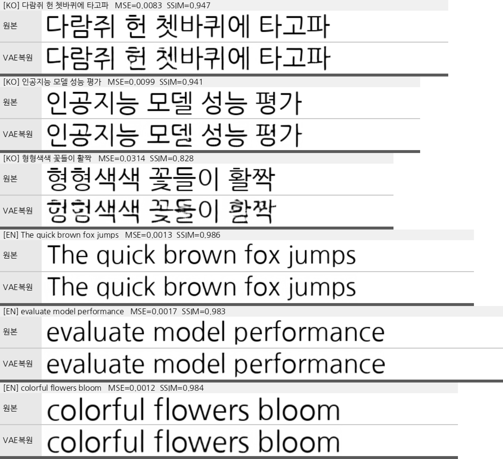

# Eruku Korean Fine-tuning

[Eruku](https://github.com/Blowing-Up-Groundhogs/Eruku) (autoregressive styled handwriting
generation, [arxiv 2510.23240](https://arxiv.org/abs/2510.23240)) 를 **한글 손글씨 라인
이미지 생성**으로 fine-tuning 하는 프로젝트.

- 목표: 한글 + 영어 + 숫자 + 구두점/특수기호 혼합 **문장 line-text 이미지** 생성
- 방식: 공식 영어 pretrained 에서 출발, 온라인 합성 데이터(폰트=writer)로 fine-tune
- 모델: T5-large + ByT5 tokenizer(한글 byte 처리) + 동결 VAE(`emuru_vae`) + 동결 OrigamiNet(영어 OCR, `alpha=1.0` 으로 loss 미사용)

## 빠른 시작 (새 머신)

```bash
git clone https://github.com/HERIUN/Eruku_korean_finetuning.git
cd Eruku_korean_finetuning

# 1. 환경 (uv)
uv sync

# 2. (선택) 데이터 파이프라인 sanity check — 학습 샘플 8개 저장
uv run python korean_split_dataset.py --n 8 --style 1 8 --gen 1 32 --out /tmp/ksplit

# 3-A. 한글 Phase 1 — 한글 glyph 학습 (논문 레시피 내장: 짧은 2~3어절,
#      virtual 256 = batch 128 × accum 2, lr 1e-4, 65000 step, num-workers 16)
CUDA_VISIBLE_DEVICES=0 uv run python train_phase1.py
#   → finetune_runs/korean_p1/  (정상완료 시 checkpoint_last.pth → Phase 2 가 resume)
#   개별 인자 덮어쓰기 가능:  uv run python train_phase1.py --batch-size 16 --grad-accum 16 --max-steps 20000

# 3-B. 한글 Phase 2 — 긴 줄 일반화 (Phase 1 ckpt 에서 resume, +5000 step)
#      논문 그대로: batch 2 × accum 128 = virtual 256, style 1~8 / gen 1~32
CUDA_VISIBLE_DEVICES=0 uv run python train_phase2.py
#   기본으로 korean_p1/checkpoint_last.pth 에서 resume, --extra-steps 5000 (= resume_step+5000 자동)
#   다른 ckpt: uv run python train_phase2.py --resume finetune_runs/korean_p1/checkpoint_step_065000.pth

# (대안) 영어 pretrained → 바로 한글 긴 줄 — Phase 1 생략, 영어능력 보존
#        lr 5e-5, max-img-len 8192, batch 16 × accum 16, english-frac 0.15, held-out val 로깅
CUDA_VISIBLE_DEVICES=0 uv run python train_korean_from_en.py   # → finetune_runs/korean_en2ko/
```

> 진입점 구조: 공통 로직은 `train_core.py`(전체 인자 `make_parser` + 학습 루프)에 있고,
> 각 Phase 스크립트(`train_phase1.py`/`train_phase2.py`/`train_korean_from_en.py`)가
> `set_defaults` 로 레시피를 덮어씌운 뒤 `train()` 을 호출한다. 개별 인자는 CLI 로 덮어쓰기 가능.

왜 두 단계인가: 논문에서 **Phase 1 (65000 iter × 256 = 16.6M 샘플, 짧은 단어쌍)** 이
byte→glyph 매핑을 만들고, **Phase 2 (5000 iter = 1.28M, 긴 줄)** 는 길이 일반화만 담당.
한글 glyph 는 영어 pretrained 에 없는 **신규 능력**이라 Phase-1 형태(짧은 샘플 = 같은
시간에 더 많은 glyph 감독)로 먼저 가르치는 것이 효율적. 단 from-scratch 는 불필요 —
VAE-latent 디코딩·자기회귀·style 메커니즘은 영어 pretrained 에서 전이됨.

- `--max-steps` / `--extra-steps` / `--save-every` / `--log-every` 는 **virtual step**(optimizer 업데이트) 기준.
  Phase 2 는 `--extra-steps N` 으로 `max-steps = resume_step + N` 을 자동계산 → 누적값 실수 방지
- 노출량(기본 레시피): Phase 1 65000 step × 256 = **16.6M 샘플**, Phase 2 5000 step × 256 = **1.28M**.
  논문은 10M 고정 데이터셋을 재사용하지만 여기선 온라인 무한 생성이라 **모든 샘플 unique**
  (resume 시에도 seed offset 으로 중복 방지). 노출량은 `--max-steps` 로 조절
- VRAM: `train_korean_from_en.py`(batch 16 × accum 16, max-img-len 8192) 측정 **~35GB**.
  Phase 1 batch 128 은 훨씬 큰 VRAM(멀티 GPU) 필요 — 단일 24GB 면 `--batch-size 16 --grad-accum 16`
  으로 낮춰 virtual 256 을 유지
- lr 은 **virtual batch 에 맞춰야** 함 (논문 lr 1e-4 = virtual 256 기준). virtual batch 를 줄이면 lr 도
  낮출 것 (batch 2 + lr 5e-5 발산 확인). 빠른 sanity: `--grad-accum 1 --lr 1e-5`

### 3-C. VAE 한글 적응 (fidelity 상한 올리기 — 아래 「VAE 한글 수용성」 참고)

동결 VAE 의 한글 재구성 한계가 fidelity 하드 상한이라, VAE 자체를 한글에 맞춘다.

```bash
# (1) 평가/loss 용 한글 HTR 리더 (easyocr 은 한글 GT 조차 CER 0.236 으로 saturated)
CUDA_VISIBLE_DEVICES=0 .venv/bin/python train_aux_htr.py --out finetune_runs/aux_htr_ko

# (2) VAE finetune — 권장 레시피: full(enc+dec) + HTR off(pure-L1)
CUDA_VISIBLE_DEVICES=0 .venv/bin/python train_vae_korean.py \
  --train-part full --htr-weight 0 --kl-weight 1e-6 \
  --batch-size 8 --grad-accum 4 --lr 1e-4 --max-steps 30000 \
  --out finetune_runs/vae_korean_full     # → vae_sXXXXX/ (diffusers AutoencoderKL 폴더)

# (3) 교체 평가 (decoder-only 는 재학습 없이 바로)
CUDA_VISIBLE_DEVICES=0 .venv/bin/python eval_htr_cer.py --ckpt <eruku ckpt> \
  --vae-checkpoint finetune_runs/vae_korean_full/vae_s30000 --n 100 --coherent

# (4) full 은 latent 가 이동하므로 Eruku 재적응 필수 (--reset-vae 로 ckpt 의 옛 vae.* strip)
CUDA_VISIBLE_DEVICES=0 .venv/bin/python train_korean_from_en.py \
  --resume <한글 ckpt> --vae-checkpoint finetune_runs/vae_korean_full/vae_s30000 --reset-vae \
  --out finetune_runs/eruku_readapt --extra-steps 15000
```

- `--train-part dec|full` — `dec` = latent 불변(교체만으로 사용) / `full` = 상한↑ 대신 재적응 필요
- `--htr-weight` — OCR 가독성 loss. **기본 0 권장**(켜면 한글 MSE·영어 모두 악화, 아래 ablation)
- `--pyramid-weight/--pyramid-levels/--pyramid-alphas` — Laplacian band-pass(고주파 우선 가중)
  loss. 기본 0 = 끔. 재현용으로 남긴 실험 경로이며 pure-L1 대비 이득 없음(아래 ablation)
- `--logvar-weighting` — 원본 LDM 관례의 학습형 관측 노이즈 가중. 기본 off, 우리 세팅선 무익
- `--val-font-frac` — 학습 폰트에서 val 폰트를 떼는 비율(폰트 일반화 측정). VRAM ~20GB(batch 8)

첫 실행 시 HuggingFace 에서 `google-t5/t5-large`(config), `google/byt5-small`(tokenizer),
`blowing-up-groundhogs/emuru_vae`, 그리고 **영어 pretrained weight**
(`blowing-up-groundhogs/eruku` 의 `pytorch_model.bin`, ~2.9GB) 를 자동 다운로드하므로
인터넷이 필요합니다. OrigamiNet OCR ckpt 는 불필요 (alpha=1.0 → OCR loss 미사용,
공식 HF 릴리즈에도 OCR 모듈 없음).

### 학습 산출물 (`--out` 디렉토리)

- `train_config.yml` — 실행마다 전체 인자+타임스탬프가 **run 히스토리**로 누적 기록
- `train_loss.csv` — `step,loss,mse,ce,it_s,timestamp` (log-every 마다, resume 시 이어 씀)
- `checkpoint_step_XXXXXX.pth` — model + optimizer + step (resume 용)
- `train_samples/`(+`_en`) — `--save-samples N` 지정 시 학습 데이터 샘플 + montage.
  **모델이 실제로 받는 style 복원 열** 포함(style-len·정규화 fix end-to-end 검증용)
- `val_set.pt` / `val_samples/` — `--val-every>0` 시 **고정 held-out val 세트**(디스크 저장 → run 간 재사용,
  매번 새로 샘플링 안 함). 한글(unseen 폰트)+영어를 `--english-frac` 비율로 섞고, `--val-samples` 로 총량 지정
- `val_loss.csv` — `step,val_loss,val_mse,val_ce,timestamp`
- `truncated_samples.csv` — **절대 truncation 금지 정책**: `max_img_len` 예산 초과로 style/gen 이 잘릴
  샘플은 학습에서 **drop** 하고 여기에 기록(step/종류/길이/텍스트). 몇 개중 몇 개 버렸는지 추적

### 이어 학습 (resume)

```bash
uv run python train_phase2.py \
  --resume finetune_runs/korean_p2/checkpoint_step_004000.pth --max-steps 200000
```

resume 시 이전 run 의 `train_config.yml` 과 인자가 다르면 `[config WARN]` 으로 알려줍니다
(lr/batch 등 바뀐 채 이어 학습하는 실수 방지).

## 학습 데이터 생성 (온라인 합성, 디스크 0)

학습 데이터는 **디스크에 미리 저장하지 않고 매 step 새로 합성**한다 (`korean_split_dataset.py`
= 원본 repo `OnlineSplitFontSquare` 의 한글 서브클래스). 따라서 모든 샘플이 unique 이고
사실상 무한 데이터셋. 한 샘플 = `(style_img, style_text, gen_img, gen_text)` 4-tuple.

### (1) 폰트 = writer
- **한글 손글씨/디스플레이 폰트 83종** (`assets/fonts_korean_v2/train/` 의 .ttf).
  Eruku 의 "writer(필체)" 개념을 폰트 1종 = writer 1명으로 매핑.
  (초기 손글씨 폰트 + Google Fonts 한글(`tools_fetch_gf_korean.py` 수집)을 병합해 현재 83종)
- 렌더가 깨지는 폰트 3종(NMFClassic, GangwonEduSaeeum, KCCPakKyongni)은 제거됨.
- `fonts_charsets.json` 에 각 폰트의 charset 을 캐시 → 폰트가 못 그리는 글자(두부 □)를
  애초에 샘플하지 않아 tofu 방지.
- **held-out 테스트 폰트 16종** (`assets/fonts_korean_v2/test/`): 학습에 안 쓴 폰트.
  최종 일반화 평가 전용. 학습 중 val 은 기본적으로 train 폰트에서 `--val-font-frac`(기본 0.1)
  비율만큼 결정적으로 분할해 **학습에서 제외**하고 사용 → 본 적 없는 폰트로 val loss 측정.
  (`--val-fonts-dir` 로 특정 디렉토리를 val 로 지정할 수도 있음)
- **영어 폰트 177종** (`assets/fonts_english/`, `--english-fonts-dir` 기본값):
  `--english-frac > 0` 일 때 라틴 폰트 데이터를 섞어 영어 스타일 다양성 보강 (`tools_fetch_gf_english.py` 로 수집).

### (2) 텍스트 = MixedLineSampler 로 합성한 가짜 라인
style 텍스트와 gen(target) 텍스트를 **각각 독립적으로**, 아래 비중으로 토큰을 섞어 1줄 생성
(`korean_split_dataset.py:65`, 원본 논문의 "English + random words" 를 한글로 확장):

| 토큰 종류 | 비중 | 출처 |
|---|---|---|
| 한글 단어 | **0.45** | `assets/corpus/korean_lines.txt` (한 줄당 한 문장, 1.7MB) 에서 어절 추출 |
| 영어 단어 | **0.20** | `assets/corpus/english_words.txt` (466,511 단어) |
| 숫자 | **0.20** | 날짜/시각/금액/전화번호 등 패턴 생성 |
| 랜덤음절 | **0.15** | KS X 1001 **2,350 음절**(전 폰트 교집합)에서 균등추첨한 1~4글자 가짜 단어 |
| + 구두점 0.35 / 특수기호 0.08 확률로 토큰에 부착 | | |

- **랜덤음절(rand)** = 논문 "random words" 대응. 코퍼스 빈도 편향 없이 전 음절을 단어
  맥락에서 노출시켜 희귀 글자까지 학습 (2,000라인 샘플 시 2,347/2,350 음절 등장 확인).
- 어절 수 범위는 Phase 별로 다름: **Phase 1 = style 2~3 / gen 2~3**,
  **Phase 2 = style 1~8 / gen 1~32** (긴 줄). `--style-words` / `--gen-words` 로 조절.

### (3) 렌더 → 증강 → split
1. style/gen 두 텍스트를 **같은 폰트**로 각각 이미지 렌더 (높이 64px).
2. 증강 적용 (`custom_datasets/font_square/font_square_split.py:180-189`):
   `RandomRotation(±3°, p=0.5)`, **`RandomWarping`(TPS 비선형 휨, p=1.0 항상)**,
   `GaussianBlur(p=0.5)`, `GrayscaleDilation(p=0.1)`, `ColorJitter(p=0.5)`,
   종이배경 합성, ink jitter. → 실제 손글씨의 왜곡에 robust 하게 학습.
   (생성 결과가 휘어 보이는 건 이 warp 를 모델이 학습·재현한 정상 동작)
3. 폭 기준으로 잘라 `style_img`(조건) / `gen_img`(target) 로 분리.
- 데이터 sanity check: `uv run python korean_split_dataset.py --n 8 --out /tmp/ksplit`
  → 8개 style/gen pair + montage 저장.

### 원본 repo(`OnlineSplitFontSquare` + `TextSampler`) 대비 변경점

한글판은 원본 온라인 합성 파이프라인을 **서브클래스**(`KoreanSplitFontSquare`)로 재사용하되,
아래 4가지를 바꿨다. 근거는 각 항목의 코드 위치 참조.

| 구분 | 원본 repo | 한글판 (변경) | 이유 |
|---|---|---|---|
| **텍스트 소스** | `TextSampler`: 영어 단어만(nltk 6개 코퍼스 103,411단어), uni/bigram 빈도 가중 1종 sampler로 style·gen 동일 추첨 | `MixedLineSampler`: 한글0.45/영어0.20/숫자0.20/랜덤음절0.15 혼합 + 구두점·특수기호 부착. **폰트 charset 인지**(못 그리는 글자 미추첨 → tofu 방지) | 한글+숫자+기호 혼합 라인이 목표. 빈도편향 없이 전 음절 노출(랜덤음절) |
| **style/gen sampler** | 단일 sampler → style·gen 어절수 범위 동일 | style/gen **독립 sampler**(범위 분리 가능: Phase1 2~3/2~3, Phase2 1~8/1~32) | 조건(style)과 타겟(gen) 길이를 따로 통제 |
| **렌더 방식** | `[style\|gap\|gen]`을 **한 이미지로 합쳐 렌더** → 증강 → 고정 컬럼비로 분할 | style/gen을 **각각 따로 렌더**(경계 없음) | 원본은 회전·warp가 경계를 밀어 style↔gen 침범(잘림/잔상). 분리로 제거 (`korean_split_dataset.py:80-123`) |
| **증강 정책** | 합친 이미지에 일괄: RandomRotation·**RandomWarping(TPS 휨)**·Blur·배경·Dilation·ColorJitter(bright=0.05)·**RandomInvert(p=0.2)** | **RandomWarping 완전 제거**, **RandomInvert 비활성**, RandomRotation은 **style만**(gen 곧게), 배경은 **gen 흰색 강제**(style만 종이배경), ColorJitter **brightness=0**. Blur·Dilation·AlphaChannel(잉크)·Jitter는 **RNG 스냅샷으로 style·gen 동일 실현**(같은 writer 질감 매칭) | 모델 `generate()`가 흰배경·곧은 글자를 출력 → 타겟을 그렇게 학습해야 휨/배경이 전파 안 됨. style은 추론 시 실제 필기라 현실 증강 유지 |

- **폰트(writer)**: 원본 font_square 영어 폰트 → **한글 손글씨/디스플레이 폰트 83종**(`assets/fonts_korean_v2/train/`).
- `--legacy-transform` 플래그로 원본 composite(합쳐 렌더+일괄증강+경계분할) 방식을 그대로 재현 가능(전/후 비교 실험용).
- 원본 대비 **동일하게 유지**한 것: 온라인 무한 생성(디스크 0), 높이 64px, VAE-latent split 구조, `p_uncond` 텍스트 dropout 메커니즘.

### 논문 레시피 매핑
- `--text-dropout 0.05` = p_uncond (style+gen 텍스트 모두 drop → CFG 학습)
- `--style-text-dropout 0.10` = p_drop (Phase 2 전용, style 텍스트만 drop)
- Phase 1: `--style-words 2 3 --gen-words 2 3` / Phase 2: `--style-words 1 8 --gen-words 1 32`
- virtual batch 256: `--grad-accum` × `--batch-size` = 256 (논문 lr 1e-4 는 이 기준)
- 논문 iteration: Phase 1 = 65000 (16.6M 샘플), Phase 2 = 5000 (1.28M 샘플)
- target 패딩 = visual `<EOG>`: 이미 구현되어 있음 — specials 패딩값 1(=EOG) +
  forward 에서 EOG embedding 치환 + CE 로 "gen 종료 후엔 EOG 만" 학습

### 📄 파이프라인 상세 문서 & 알려진 이슈 (`docs/`)
- **`docs/DATA_GENERATION.md`** — 원본 `OnlineSplitFontSquare` 데이터 생성 전체 흐름(코드 단위).
- **`docs/PIPELINE_STEP_BY_STEP.md`** — 렌더→증강→split 을 단계별 이미지로 시각화.
  긴 텍스트에서 ①회전(`expand=False`)이 양끝을 잘라내고 ②warp 가 split cut 을 글자로 밀어넣는
  문제를 실측·정리(파이프라인은 **2~3어절 짧은 라인 가정** 위에서만 안전).
- **`docs/STYLE_LEN_BUG.md`** — ⚠️ **`get_model_inputs` 단위 버그**: `sl`(픽셀)을
  `style_img_embeds.shape[-1]`(latent=픽셀/8)과 그대로 `min` 비교해 **style/gen 이 실폭의 ~1/8
  (≈글자 1개)로 잘려** 조건으로 들어가던 문제. `* 8` 로 픽셀 환산해 수정(사용률 ~10% → ~100%,
  실측·before/after 이미지 포함). **이 수정 이전 체크포인트는 style 을 거의 못 봤으므로 재학습 권장.**
  - 재현: `PYTHONPATH=. uv run python docs/_verify_style_len.py` (사용률 ~100% 확인)

## 추론 파라미터: CFG · drop_text · style_text (중요)

생성 품질에 크게 영향을 주는 세 손잡이. 셋은 **서로 직교**하며 역할이 다르다.

### `drop_text` — CFG 켜는 스위치 (추론 시 반드시 `True`)

CFG(classifier-free guidance)는 매 스텝 **텍스트 있는 forward(cond)** 와 **텍스트 없는 forward(uncond)** 를
계산해 `out = uncond + (cond - uncond) * cfg_scale` 로 외삽한다. `drop_text` 는 그 uncond 분기가
무엇을 쓸지 결정한다:

- `drop_text=True` → uncond 가 **학습된 `uncond_embedding`("텍스트 없음" 벡터, 전체 토큰을 이 벡터로 대체)** 사용
  → `cond ≠ uncond` → CFG 작동.
- `drop_text=False` → uncond = cond → `out = cond + 0` → **CFG 무효**(cfg_scale 무시, forward 만 2배 낭비).

학습 때 text-dropout 으로 `uncond_embedding` 을 배워두므로, 추론에서 이걸 켜야(`True`) 그 표현을 활용한다.
CFG 를 안 쓸 때(`cfg_scale=1.0`)는 uncond forward 자체를 안 하므로 `drop_text` 는 무의미하다.

> ⚠️ upstream `blowing-up-groundhogs/eruku` 의 릴리즈 `modeling_eruku.py` 는 `drop_text=False` 가 기본이라
> `cfg_scale=1.25` 를 줘도 CFG 가 **무효**다(영어 in-domain 이라 CFG 없이도 선명해 티가 안 남). 한글 파인튜닝은
> CFG 증폭이 없으면 생성이 흐려지므로(예: 특정 스타일에서 거의 백지), 이 포크·HF 패키지는 `drop_text=True` 로 수정.

### `cfg_scale` — guidance 강도

클수록 텍스트 조건에 강하게 의존(진하고 또렷). 한글은 **1.5~2.0 권장**(원본 기본 1.25보다 높게).

### `style_text` — style 이미지의 전사 (넣으면 정확도 크게↑)

style 참조 이미지의 전사 텍스트. `f"{style_text}<sog>{gen_text}"` 로 gen_text 와 합쳐져 텍스트 조건이 된다.
**빈값("")이어도 동작**하지만(학습 시 `style_text_dropout=0.10` 으로 무전사 강건성 학습), **내용 정확도가
눈에 띄게 떨어진다.** held-out 폰트 CER(n=40, `drop_text=True` 동일 조건) 실측:

| style_text | gen CER↓ | 모델 오류(gap)↓ |
|---|---|---|
| 제공 | **0.197** | 0.063 |
| 빈값 "" | 0.474 | 0.340 |

가능하면 style 이미지의 실제 전사를 넣을 것. (단 위 echo 측정은 전사=목표라 best-case이며, 실사용
전사≠생성텍스트에선 이득이 이보다 작다.) `drop_text` 와는 무관 — 빈값이라고 `drop_text` 를 바꿀 필요 없다.

### 요약

| 손잡이 | 역할 | 권장 |
|---|---|---|
| `drop_text` | CFG 켬/끔 | 추론 시 **항상 True** |
| `cfg_scale` | guidance 강도 | 한글 **1.5~2.0** |
| `style_text` | 텍스트 조건에 전사 포함 | **가능하면 채우기** (정확도↑) |

## 추론 / 시각화

```bash
# style ref 용 소규모 합성 세트 생성 (lines_json 포맷)
uv run python gen_korean_fontset.py --per-font-train 5 --per-font-val 0 --out data/ref_set

# 생성 결과 그리드: [스타일 ref | 정답 예시 | 생성 cfg=...]
CUDA_VISIBLE_DEVICES=0 uv run python infer_show.py \
  --ckpt finetune_runs/korean_p2/checkpoint_step_020000.pth \
  --lines-json data/ref_set/train_lines.json \
  --seed-text "오늘 날씨가 좋아서 친구와 공원에서 커피를 마셨다 2024년" \
  --cfgs 1.0 1.25 1.5 1.75 2.0 --n-writers 4 --out _debug/show.png

# style 텍스트(ref 전사) 제공 여부:
#   기본        → style ref 의 텍스트를 조건으로 함께 줌
#   --no-style-text → style 이미지만으로 스타일 파악(전사 미제공). 컬럼 라벨에 (no-stext) 표시.
#   둘을 비교하려면 같은 인자로 두 번 실행(--out 만 다르게):
uv run python infer_show.py --ckpt ... --out _debug/show_stext.png
uv run python infer_show.py --ckpt ... --out _debug/show_nostext.png --no-style-text
```

## repo 구조

```
# 학습
train_core.py              # 학습 공통 코어 (make_parser 전체 인자 + 학습 루프)
train_phase1.py            # Phase 1 진입점 (짧은 어절, batch128×2, 65000 step)
train_phase2.py            # Phase 2 진입점 (긴 줄, resume, +5000 step)
train_korean_from_en.py    # 영어 pretrained → 한글 직접 (Phase 1 생략)
train_eruku_continous.py   # (원본 repo 스타일 트레이너: wandb/accelerate/webdataset 기반, 참고용)
train_vae_korean.py        # VAE 한글 적응 finetune (--train-part dec|full, htr/pyramid/logvar 항)
train_aux_htr.py           # 한글 HTR 리더 finetune (VAE 의 HTR loss + 평가 리더 겸용)
korean_aux_dataset.py      # HTR 학습용 (라인이미지, 전사) 데이터셋
custom_datasets/korean_alphabet.py  # HTR alphabet (assets/korean_charset.json 기반)
tools_fetch_aux.py         # HTR 학습용 aux 데이터 수집
# 데이터
korean_split_dataset.py    # 온라인 한글 split 데이터셋 (+ CLI 샘플 덤프, --show-model-input)
gen_korean_fontset.py      # 오프라인 라인 생성기 + MixedLineSampler/build_pools (공용)
assets/download_script/tools_fetch_gf.py  # Google Fonts 수집기 (--lang ko|en, 한/영 통합)
assets/font_view/render_overview.py       # 폰트 오버뷰 montage (샘플 렌더 + 글자수 분류)
tools_font_audit.py        # 폰트 품질 감사: 미지원(두부)·malformed 글리프 스캔 (코퍼스 기준)
# 추론 / 평가  (infer_show.py 가 공유 라이브러리: load_model/gen_arr/render_in_font …)
infer_show.py              # 자기설명적 결과 뷰어 [스타일ref|정답|생성 cfg…] (--exclude-writers 로 폰트 제외)
infer_matrix.py            # 스타일×텍스트 매트릭스 뷰어 (1 style → 여러 gen_text)
infer_echo_compare.py      # echo(style==gen) 모델 나란히 비교 뷰어
eval_echo_metrics.py       # echo 정량 (MSE/SSIM/LPIPS/FID)
eval_cer.py                # echo CER (easyocr 기반 — 한글은 saturated, 교차검증용)
eval_htr_cer.py            # 생성 CER (한글 HTR 리더, 렌더바닥 ~0.00) ← 한글 주 지표
eval_all.py                # 통합 평가 배터리 (eval_cer+eval_echo_metrics 오케스트레이션)
tools_hf_upload.py         # HF 릴리즈 (ckpt→릴리즈 클래스 변환 + VAE/모델 repo 업로드)
# 일회성 실험/검증 스크립트 (결론은 본 README·docs 에 기록됨. 루트에서 PYTHONPATH=. 로 실행)
experiments/_eval_vae_recon.py         # VAE roundtrip 복원 비교 (고정 probe: ko/en/극단폰트)
experiments/_eval_vae_hw_recon.py      # 실제 손글씨 복원 비교 (일반화)
experiments/_eval_vae_compare.py       # VAE 여러 개 나란히 비교
experiments/_eval_vae_height_sweep.py  # 입력 height 스윕 — h>64 이득을 self/native 두 기준으로 측정
experiments/_eval_vae_norm_check.py    # [-1,1] vs [0,1] 정규화 검증 (복원 + Eruku 생성까지)
experiments/_eval_vae_prep_sweep.py    # 입력 전처리 스윕 (self MSE/SSIM + HTR CER damage)
experiments/_eval_vae_prep_minrec.py   # 최소 vs 권장 전처리 — 공통 캔버스 기준 비교
experiments/_eval_gen_compare.py       # Eruku 생성 전/후 montage (같은 VAE → 순수 T5 개선분)
experiments/_eval_gen_heldout.py       # held-out 폰트(custom_hw_fonts) 생성 montage
experiments/_eval_mirror_compare.py    # 실제 손글씨 style 미러링 + ink bbox 크롭 검증
# 모델 / 원본 코드
eruku_continuous_inf.py    # Emuru 모델 (forward/generate) — style-len 단위버그 수정됨
custom_datasets/           # 원본 repo 데이터 코드 (font_square 렌더/증강, tps)
models/                    # OrigamiNet 등
docs/                      # 파이프라인 상세/버그 분석 문서 + 재현 스크립트·이미지
assets/
  fonts_korean_v2/train/   # 한글 손글씨/디스플레이 폰트 83개 + fonts_charsets.json
  fonts_korean_v2/test/    # held-out 테스트 폰트 16개 (최종 일반화 평가 전용)
  fonts_english/           # 영어(라틴) 폰트 177개 (--english-fonts-dir 기본값)
  fonts_label/             # NanumGothic (뷰어 라벨용)
  backgrounds/             # 종이 배경
  corpus/                  # korean_lines.txt(한 줄당 한 문장) / chars.txt / english_words.txt
  font_view/               # 폰트 오버뷰 스크립트 + 폴더별 overview_*.png
  custom_hw_fonts/         # AI 손글씨 폰트 4종 — 학습 미사용, held-out 평가 전용
  korean_charset.json      # HTR alphabet 문자 집합(2509자)
custom_datasets/hw_line_sample/  # 실제 손글씨 라인 20장 + label.txt (미러링/복원 평가용)
```

### 폰트 오버뷰 (어떤 글씨체인지 한눈에 보기)

```bash
uv run python assets/font_view/render_overview.py    # assets 폰트 폴더 전체 → assets/font_view/overview_*.png
uv run python assets/font_view/render_overview.py --dirs assets/fonts_korean_v2/test   # 특정 폴더만
```

폴더별 montage PNG 생성: 행마다 [파일이름 + 지원 글자수 분류(전체/한글/한자/영문/숫자/기호/기타) |
샘플 1줄 렌더(한글+영어 대/소문자+숫자+특수기호)]. 폰트 추가/교체 후 다시 실행하면 갱신됨.

## 지금까지의 실험 요약 (2026-06 기준)

| 실험 | 결과 |
|---|---|
| 공식 pretrained, 영어 생성 | 완벽 (문장 전체, in-style, EOG 정상) → 모델/추론 코드 정상 |
| lr 5e-5 fine-tune (online split) | **발산** — mse 진동, 전 토큰 blank 붕괴 |
| lr 1e-5 fine-tune 4K step | 안정 (loss 1.61→1.04). 영어 능력 보존 + 한글 폰트 style 적응 시작. 한글 glyph 는 아직 미생성 (숫자 조각부터 emerge) |

핵심 인사이트:
- **lr 1e-5 권장.** 5e-5 는 영어 init 에서 발산.
- 한글 glyph 생성은 byte→glyph 매핑의 **신규 학습**이라 scale 필요 (논문 Phase2 = 10M 샘플). 4K step(8K 샘플)은 0.1% 미만 — 장기 학습 필수.
- style ref 가 학습 분포(합성 폰트) 밖이면 생성이 붕괴(OOD). fine-tune 이 진행될수록 한글 폰트 prefix 에 적응.
- 모델은 SOG 전까지 style 텍스트 나머지를 이어 그린 뒤(target 앞 echo) gen 텍스트를 그림 — 뷰어는 입력 style 폭만큼 잘라 보여주므로 echo 가 생성부 앞에 보일 수 있음.
- 렌더가 깨지는 폰트 3종(NMFClassic, GangwonEduSaeeum, KCCPakKyongni)은 assets 에서 제거됨.

## 모델 성능 비교 (echo 정량, 2026-07)

측정 방식: **echo(style_text == gen_text)** — 텍스트 T 를 폰트로 깨끗이 렌더한 GT 를 style 로 주고 같은 T 를
생성, GT 와 비교. n=100 다양 길이(1~15어절), cfg=1.0, seen 폰트. 스크립트 `eval_echo_metrics.py`.
(↓ 낮을수록 좋음: MSE·LPIPS·FID / ↑ 높을수록: SSIM. **굵게 = 열 최고**)

### 한글 (echo, n=100)

| 모델 (step) | MSE↓ | SSIM↑ | LPIPS↓ | FID↓ |
|---|---|---|---|---|
| 구 transform 20k | 0.195 | 0.364 | 0.459 | 75.6 |
| **v2 20k** | **0.187** | **0.377** | **0.450** | **70.7** |
| v2 24k | 0.207 | 0.344 | 0.464 | 81.7 |
| v2 27k | 0.194 | 0.370 | 0.462 | 76.6 |
| v2 30k | 0.208 | 0.336 | 0.450 | 75.0 |

### 영어 (echo, n=100, pretrained 포함)

| 모델 | MSE↓ | SSIM↑ | LPIPS↓ | FID↓ |
|---|---|---|---|---|
| pretrained (영어 원조) | **0.145** | **0.503** | 0.421 | 84.8 |
| 구 transform 20k | 0.168 | 0.455 | 0.367 | 54.4 |
| **v2 20k** | 0.162 | 0.468 | 0.324 | **52.5** |
| v2 30k | 0.170 | 0.453 | **0.318** | 57.3 |

### 정성 관찰 (montage/CER)

- **완성도(문장 끝맺음)**: pretrained 는 긴 표준영어 완전완성(16~17어절)에 강함. v2 는 긴 **한글**을 30k 에서
  4/4 완성(20k 은 반복붕괴)했으나 긴 **영어**는 아직 반복붕괴 → 학습분포상 긴영어 부족(전체의 ~10%).
- **출력 스타일**: v2 는 gen 을 **흰배경·곧은글자(무휨)** 로 생성(새 데이터 정책). 구 모델은 휨/배경 잔존.
- **트레이드오프**: 한글·폰트 스타일적응(v2) ↔ 긴 영어 완성(pretrained). v2 20k 가 파인튜닝 중 fidelity 정점,
  30k 는 긴한글 완성↑ 이나 fidelity 소폭↓(과적합).
- **주의(지표 해석)**: 픽셀(MSE/SSIM)은 글자 위치/간격 정렬오차에 민감해 절대값 과소평가·언어간 비교 부적절;
  FID(n=100)는 노이즈 큼. **OCR 기반 CER**(`eval_cer.py`, 정렬무관·언어공정·완성도 반영)로 정밀 재측정 진행 중.
- 도구: `infer_show.py`(그리드), `infer_matrix.py`(스타일×텍스트 매트릭스), `infer_echo_compare.py`(모델 나란히),
  `eval_echo_metrics.py`/`eval_cer.py`(정량).

## 한글 학습의 하드 상한: VAE 한글 수용성 (2026-07)

en2ko fine-tune(영어 pretrained→한글)에서 한글 CER 이 step **~11k 부근에서 plateau** 하고, 그 이상 학습하면
val loss 만 오르고(과적합) 영어가 소폭 퇴보한다. 아무리 더 돌려도 한글 fidelity 가 어느 선 위로 안 올라간다.
원인은 학습 부족이 아니라 **동결 VAE 의 한글 재구성 한계**다.

모델은 픽셀이 아니라 **VAE latent** 만 조건·타깃으로 쓴다(latent 1열 = 8차원). 따라서 `decode(encode(x))` 가
못 담는 디테일은 모델이 애초에 조건으로 볼 수도, 타깃으로 배울 수도 없다 = **한글 학습의 하드 상한**.

같은 폰트(NanumGothic)로 한글/영어를 VAE 왕복(encode→decode)시킨 재구성 오차 — 근거 스크립트 `docs/_vae_capacity.py`:

| | 평균 MSE↓ | 평균 SSIM↑ | 최악 사례 |
|---|---|---|---|
| **한글** | **0.0165** | **0.906** | "형형색색 꽃들이 활짝" → SSIM **0.828** (밀집 음절 뭉개짐) |
| **영어** | 0.0014 | 0.984 | 3개 모두 SSIM ~0.98 (거의 완벽 복원) |

한글 재구성 오차가 영어의 **약 12배**. 특히 획이 밀집한 음절(형·꽃·활짝)에서 심하게 흐려진다 —
초·중·종성이 한 칸에 2D로 쌓이는 한글이, latent 폭당 8차원 표현에서 영어(선형 단순 글자)보다 불리하기 때문.



*각 예: 원본 vs VAE복원. 영어는 원본과 거의 동일, 한글은 밀집 음절일수록 뭉개짐(=모델이 볼 수 있는 정보의 상한).*

**함의 — 한글 fidelity 를 더 올리려면 학습이 아니라 VAE 를 손대야 한다:**
- (a) **VAE decoder 파인튜닝** — encoder/latent 고정(T5 인터페이스 유지) → 출력 렌더 충실도만 개선. **저위험**.
- (b) **입력 해상도↑** (h=64→96, latent 세로 8→12로 용량↑). 단 `query_emb`/`t5_to_vae` 재init 필요.
- (c) **한글로 VAE encoder+T5 공동 재학습** — conditioning 정보 상한 자체를 올림. **고위험**(pretrained 강점 재학습).

### VAE 한글 적응 실험 결과 (2026-07): **full(enc+dec) + HTR off 가 최선**

위 (a)/(c) 를 실제로 학습해 비교. 파이프라인: 한글 HTR finetune(`train_aux_htr.py`) → VAE finetune(`train_vae_korean.py`) →
교체 검증(`infer_show.py`/`eval_cer.py --vae-checkpoint`). clean-bw roundtrip MSE(고정 probe, `experiments/_eval_vae_recon.py`):

| VAE | 일반 한글 | 극단 폰트 | 영어 |
|---|---|---|---|
| 원본 emuru | 0.0188 | 0.0197 | 0.0020 |
| decoder-only + HTR | 0.0120 (−36%) | — | 0.0032 |
| **full + HTR(0.3)** | 0.0089 (−53%) | 0.0183 | 0.0037 ⚠️영어 **악화** |
| **full + HTR off (pure-L1)** ⭐ | **0.0031 (−83%)** | **0.0128** | **0.0012** |

**핵심 발견 — VAE 한글 적응은 `--train-part full --htr-weight 0`(HTR 끔)이 결과가 제일 좋다:**
- HTR(OCR 가독성) loss 는 **MSE 를 최적화하지 않는다** — "정확한 글자로 읽히게"(프로토타입) 밀어서 그 폰트의 정확한 획에서 멀어짐 → 픽셀 MSE↑. 텍스트는 흑백 고대비라 **L1 만으로 이미 획이 또렷**해서 HTR 가독성 기여가 중복이고, 프로토타입 편향·1채널 용량 경쟁 비용만 남는다.
- 특히 **한글 HTR 은 영어를 악화**시킴(공유 decoder 를 한글 획으로 편향, 0.0020→0.0037). pure-L1 은 스크립트 중립이라 영어도 개선.
- pure-L1 이라도 **흐릿해지지 않음** — 극단 폰트(초굵은/붓글씨)에서도 획을 선명히 살림(고대비 → L1 이 엣지 보존).
- 원본 Emuru 가 HTR 로 이득 본 건 배경노이즈 **디노이징** 태스크 + 영어HTR·영어데이터 정합 + 10만폰트 맥락이라, 깨끗한 한글 폰트 복원인 우리와 상황이 다름.

권장 레시피(VAE finetune): `--train-part full --htr-weight 0 --kl-weight 1e-6`, warm-start(decoder-only→full 순), 지표는 held-out roundtrip MSE.
**주의**: `train-part full` 은 latent 공간이 바뀌므로 Eruku 를 **기존 한글 ckpt 에서 resume + `train_core.py --reset-vae`**(ckpt 의 옛 vae.\* strip) 로 재적응해야 한다. decoder-only 는 latent 불변이라 재학습 없이 `--vae-checkpoint` 교체만으로 사용 가능.
한계: held-out 극단 폰트는 여전히 높음(폰트 다양성 부족, 원본 10만 vs 우리 99). 증강·균일빈도로는 오히려 악화 → 폰트 수집이 유일한 진짜 레버.

#### log_var(학습형 관측 노이즈 가중) — 논문 아닌 원본 *코드* 관례, 우리 세팅선 무익 → [`docs/VAE_LOGVAR.md`](docs/VAE_LOGVAR.md)

원본 `models/autoencoder_loss.py` 의 `nll/exp(log_var)+log_var` 항(LDM/CompVis Kendall식 학습형 recon 가중, **논문엔 없음**)을 `--logvar-weighting` 로 복원해 통제실험. 원본 emuru VAE 에서 동일 seed·데이터·예산(full·pure-L1·15000step)으로 **log_var 유무만** 다르게(`run_logvar_clean.sh`):

| VAE (s15000) | 일반 한글 | 극단 폰트 | 영어 |
|---|---|---|---|
| 원본 emuru | 0.0188 | 0.0197 | 0.0020 |
| control (logvar off) | **0.0038** | **0.0131** | **0.0014** |
| logvar on | 0.0037 (동률) | 0.0138 (+5%) | 0.0015 (+7%) |

**결론 — log_var 무익, 기본 off**: 그 수학적 실익(관측 노이즈 MLE 자기보정·grad 스케일 정규화·다중 loss 항 밸런싱)은 모두 "여러 항을 섞고 KL 이 유의미할 때" 발동하는데, 우리는 **KL=1e-6(무시수준)·단일 L1 항·Adam(이미 grad 정규화)** 이라 발동 여지가 없다. 최종 `lv=-1.481` 로 이론 종착점 `s*=log L≈-3.5` 에 15k step 내 수렴도 못 함(inert). ko 동률·hard/en 미세 열화로 실측 확인. → `--logvar-weighting` 플래그만 재현용 보존, 기본 off.

#### loss 항 ablation (pyramid / HTR / 예산) — 결론: **pure-L1 이 최선, 예산이 진짜 레버**

`--pyramid-weight`(Laplacian band-pass = 고주파 대역 가중, 획 엣지를 더 세게 감독하려는 시도) 와
HTR 가중치를 조합해 **같은 seed·데이터**로 통제 비교. 지표는 학습 중 held-out **폰트** val
roundtrip(각 런 `vae_val.csv` 마지막 행, `--val-font-frac 0.1`, seed 42):

| 런 (step) | train-part | loss 항 | 한글 MSE↓ / SSIM↑ | 영어 MSE↓ |
|---|---|---|---|---|
| `vae_orig_dec_pureL1` (15k) | dec | L1 | 0.00972 / 0.9514 | 0.00205 |
| `vae_orig_dec_pyr` (15k) | dec | L1+pyr | 0.00997 / 0.9382 | 0.00191 |
| `vae_orig_pureL1` (15k) | full | L1 | 0.00713 / 0.9597 | 0.00196 |
| `vae_orig_pureL1_logvar` (15k) | full | L1+logvar | 0.00828 / 0.9539 | 0.00189 |
| `vae_orig_full_L1_htr01` (15k) | full | L1+htr 0.1 | 0.01048 / 0.9364 | 0.00266 |
| `vae_orig_full_pyr_htr01` (15k) | full | L1+pyr+htr 0.1 | 0.00894 / 0.9438 | 0.00198 |
| `vae_orig_full_pyr` (30k) | full | L1+pyr | 0.00645 / 0.9591 | **0.00143** |
| `vae_orig_full_pyr` (45k, 30k에서 resume 연장) | full | L1+pyr | 0.00711 / 0.9558 | 0.00140 |
| **`vae_korean_full_mse` (28k)** ⭐ 릴리즈 | full | L1 (디렉토리명만 mse) | **0.00656 / 0.9647** | 0.00161 |
| `vae_orig_full_htr03_30k` (30k, 완료) | full | L1+htr 0.3 | 0.01156 / 0.9263 | 0.00323 |

- **pyramid 는 이득 없음** — 같은 15k 예산에서 pure-L1 과 사실상 동률이거나 약간 나쁨
  (dec 0.00997 vs 0.00972, SSIM 은 −1.3%p). 텍스트는 이미 흑백 고대비라 L1 자체가 엣지를
  보존하므로 고주파 가중이 **중복**이다. 유일한 쓸모: htr 을 켠 조합에서 그 해악을 일부 상쇄
  (0.01048 → 0.00894) — 즉 "htr 로 흐려진 걸 pyr 로 되돌리는" 구조라, htr 을 끄면 필요 없다.
- **htr 은 예산을 30k 로 늘려도 열위**(완료 s30000 에서 0.01156, 영어도 0.0032) → 위 「HTR off」 결론 재확인.
- **예산은 듣지만 30k 부근에서 포화**: 동일 pure-L1 계열에서 15k 0.00713 → 28~30k 0.0065 로 내려간 뒤,
  그 이상은 더 안 내려간다.
- ⚠️ **resume 로 예산을 늘리면 오히려 퇴보할 수 있다.** `full_pyr` 을 s30000 에서 45k 까지 이어 돌린 결과
  0.00645 → s36000 0.00736 → s45000 0.00711 로, 15k step 을 더 쓰고도 **자기 최적점을 회복하지 못했다**.
  resume 는 Adam 상태·lr 스케줄을 새로 시작하므로 좋은 지점에서 밀려난다. 연장할 거면 처음부터 긴 예산으로
  한 번에 돌리고, 중간 최적 ckpt 는 반드시 보존할 것.
- 30k 예산에서 `full_pyr` 과 `full_mse` 는 한글 동급(0.00645 vs 0.00656)이고 SSIM 은 full_mse 가
  낫다 → **릴리즈는 `full_mse` s28000 유지**(교체 시 Eruku 재적응이 다시 필요한데 이득이 없음).

### Eruku 재적응 결과 (2026-07): full_mse VAE + 단문강조 재학습 → 생성 병목(단문) 해소

full_mse VAE 는 재구성 상한을 크게 올렸지만(roundtrip MSE −83%), 그 상한이 **실제 생성으로 발현되려면 T5 를
새 latent 공간에 재적응**시켜야 한다(full 은 latent 이동 → Eruku resume 필수). 진단 결과 생성 병목은 VAE decode 가
아니라 **T5 의 단문 latent 예측**이었다(한글 단문 CER ~0.5, 장문은 ~0.05). 이를 겨냥해 단문 비중을 높인 재적응을 수행:

```
# eruku_readapt_fullvae(full_mse VAE 내장) s15000 에서 resume, 단문강조
CUDA_VISIBLE_DEVICES=2 .venv/bin/python train_korean_from_en.py \
  --resume finetune_runs/eruku_readapt_fullvae/checkpoint_step_015000.pth \
  --out finetune_runs/eruku_short_fullmse \
  --gen-words 1 12 --style-words 1 8 --max-img-len 4096 \
  --extra-steps 15000 --batch-size 4 --grad-accum 8 --lr 5e-5 \
  --english-frac 0.15 --num-workers 16 --save-every 2000 --val-every 2000
```

**평가 = `eval_htr_cer.py`** (한글 HTR 리더, 렌더바닥 CER ~0.00 — easyocr 은 한글 GT 조차 0.236 로 saturated 해 못 씀).
n=100, cfg=1.0, coherent:

| 버킷 | decoder-only | full_mse (재적응 전) | **full_mse + 단문재적응 s30000** |
|---|---|---|---|
| 한글 **전체** | 0.203 | 0.211 | **0.127 (−40%)** |
| 한글 **단문(1~3)** | 0.497 | 0.540 | **0.286 (거의 절반)** |
| 한글 중문(4~8) | — | — | 0.049 |
| 한글 장문(9~15) | — | — | 0.059 |
| 영어 전체 | 0.084 | 0.056 | **0.045 (회귀 없음)** |

**핵심 결론**:
- 생성 품질 = **VAE(상한) × T5(상한 근접도)**. full_mse VAE 로 상한을 올린 뒤 단문강조 재적응이 T5 병목을 잡아, 단문 한글 CER 을 **0.54→0.29 로 절반** 냈다. 영어도 회귀 없이 개선.
- **best ckpt = `finetune_runs/eruku_short_fullmse/checkpoint_step_030000.pth`**. val_mse 는 s20000(0.100)이 s30000(0.113)보다 낮지만, 실제 생성 CER 은 s30000 이 우수(전체 0.127 vs 0.138, 단문 0.286 vs 0.317) — **val_mse 노이즈는 생성품질과 무관**하므로 CER 로 고를 것.
- 복잡획(밝·붉·닭·삶·값·짧…) 단문 생성 전후 비교: `finetune_runs/eruku_short_fullmse/_eval/gencmp_{ko_complex_short,ko_short,ko_long}.png` (재적응 전 s15000 vs 후 s30000, 동일 VAE — 차이는 순수 T5 개선분). 스크립트 `experiments/_eval_gen_compare.py`.

> 실행 환경 주의: 이 repo 는 **`.venv/bin/python`** 으로 실행한다(torch 2.9+cu128, diffusers/skimage/transformers 포함). 시스템 `python`(miniconda base)에는 numpy 조차 없다.

### VAE 강건성 & 실제 손글씨 미러링 → [`docs/VAE_ROBUSTNESS.md`](docs/VAE_ROBUSTNESS.md)

폰트-렌더 입력은 잘 되지만 **실제 스캔 손글씨 style** 에서 드러난 두 별개 결함을 정리한 문서:
- **① 프로토타입 붕괴**(decoder/복원): VAE 가 입력 잉크농도를 무시하고 항상 crisp 순검정으로 snap →
  headline MSE 이득의 일부가 "crisp 타깃 snap" 이고 실제 손글씨 복원은 악화. 수정=농담보존 타깃(재학습 필요).
- **② 실제 손글씨 runaway**(encoder/조건): style 이미지 **여백** 이 latent std 를 폰트의 6~29배로 튀겨 T5 OOD →
  runaway/blank. **수정=밀도 기반 ink bbox 크롭**(재학습 불필요, `experiments/_eval_mirror_compare.py`). 근본은 학습이
  style 을 항상 프레임 꽉 채운 상태로만 본 갭.

## HuggingFace 릴리즈 (2026-07)

최고 조합을 **repo 2개**로 발행한다. 업로드/변환은 `tools_hf_upload.py` 로 재현한다.

| repo | 내용 | 왜 분리하나 |
|---|---|---|
| [`HERIUN/eruku_korean`](https://huggingface.co/HERIUN/eruku_korean) | T5 + proj + 특수토큰 (`model.safetensors`) + remote code(`modeling_eruku.py`) | 상위 진입점 |
| [`HERIUN/emuru_vae_korean`](https://huggingface.co/HERIUN/emuru_vae_korean) | 한글 적응 VAE (diffusers `AutoencoderKL`) | `modeling_eruku.py` 가 `AutoencoderKL.from_pretrained(config.vae_name_or_path)` 로 **VAE 가중치를 그 repo 에서 실제로 내려받기** 때문 |

**T5 는 별도 업로드가 필요 없다** — `T5Config.from_pretrained(config.t5_name_or_path)` 로 구조만
받고 가중치는 상위 repo 의 weight 파일에서 전부 덮인다. 반면 VAE 는 가중치를 원격에서 가져오므로,
`full` 로 학습해 latent 가 이동한 우리 VAE 를 **config 가 가리키게** 해야 조합이 맞는다
(원본 `blowing-up-groundhogs/emuru_vae` 를 가리킨 채 T5 만 갈면 생성이 무너진다).

```bash
# 0) 카드용 before/after figure (영문 라벨, /tmp/relfig 에 4장)
#    - VAE 복원: 원본 emuru_vae vs 릴리즈 VAE (한글/영어)
for L in ko en; do CUDA_VISIBLE_DEVICES=0 PYTHONPATH=. .venv/bin/python experiments/_eval_vae_recon.py --lang $L --label-lang en \
  --models "original=blowing-up-groundhogs/emuru_vae" "ours=finetune_runs/vae_korean_full_mse/vae_s28000" \
  --out /tmp/relfig/recon_$L.png; done
#    - 생성: 원본 영어 pretrained(원본 VAE) vs 릴리즈(한글 VAE + 재적응 T5)
PRE=$(ls ~/.cache/huggingface/hub/models--blowing-up-groundhogs--eruku/snapshots/*/pytorch_model.bin | head -1)
CUDA_VISIBLE_DEVICES=0 PYTHONPATH=. .venv/bin/python experiments/_eval_gen_compare.py --ckpt-before "$PRE" \
  --ckpt-after finetune_runs/eruku_short_fullmse/checkpoint_step_030000.pth \
  --label-before "BEFORE: original pretrained (English, original VAE)" \
  --label-after "AFTER: this release (Korean VAE + re-adapted T5)" \
  --col-labels "style reference (input)" "target (rendered in that font)" \
  --row-label-fmt "style: {font}" "target: {text}" \
  --cats ko_release en_release --n-rows 4 --out-dir /tmp/relfig

# 1) VAE 먼저 (상위 repo 로드가 이걸 요구).  --figures-dir 주면 samples/ 로 올리고 카드에 삽입
.venv/bin/python tools_hf_upload.py vae --figures-dir /tmp/relfig --push
# 2) 상위 모델: 변환 → 키 정합성 assert(missing/unexpected 0) → 생성 parity → 업로드
CUDA_VISIBLE_DEVICES=0 .venv/bin/python tools_hf_upload.py model --verify-cer   # dry-run
.venv/bin/python tools_hf_upload.py model --figures-dir /tmp/relfig --push
```

- 변환 시 로컬 학습 클래스에만 있는 `t5_to_ocr.*`(alpha=1.0 이라 미사용) 1키를 strip 하고,
  `vae.*` 252키는 그대로 남긴다(config 의 VAE repo 와 동일 가중치 = 이중 안전판)
- `save_pretrained` 가 `auto_map` 의 `AutoConfig` 항목을 떨어뜨려 `trust_remote_code` 로드가
  깨지는 문제 → 원본 값으로 보완한다
- ⚠️ **릴리즈 클래스와 학습 클래스는 style prefix 규약이 다르다.** 릴리즈
  `get_model_inputs` 는 style latent 뒤에 SOG placeholder 열(ones) 1개를 붙이고,
  `generate` 가 반환 전에 `style폭+1` 만큼을 **내부에서 잘라낸다**. 로컬은 안 붙이고 안 자르며
  `infer_show.gen_arr` 가 special 시퀀스의 첫 SOG 로 자른다. 둘을 섞어(릴리즈 출력에 gen_arr
  크롭을 겹쳐) 쓰면 이중 크롭으로 생성물이 날아간다 — 릴리즈 경로는 `generate_handwriting`
  하나로만 쓸 것. 검증은 `--verify-cer`(공개 API 그대로 CER 측정)로 한다
- 업로드하는 `modeling_eruku.py` 에는 **ink bbox 크롭**(`generate_handwriting(bbox_crop=True)`)을
  추가했다. 실제 스캔 손글씨의 여백이 latent std 를 폰트의 6~29배로 튀겨 runaway/blank 를
  만드는 문제(→ [`docs/VAE_ROBUSTNESS.md`](docs/VAE_ROBUSTNESS.md) ②)의 추론측 해결책

```python
from transformers import AutoModel
from PIL import Image
m = AutoModel.from_pretrained("HERIUN/eruku_korean", trust_remote_code=True).eval().cuda()
img = m.generate_handwriting(style_image=Image.open("style_line.png"),
                             style_text="조용히 책을 읽었다.",   # style 전사(주면 정확도↑)
                             gen_text="한국어 손글씨 생성", cfg_scale=1.5)
```

## 요구 사양

- CUDA GPU ≥ 24 GB (batch 2, max-img-len 2048 기준; T5-large 705M trainable).
  VAE 적응(`train_vae_korean.py` batch 8 × accum 4)은 ~20 GB, 한글 HTR(`train_aux_htr.py`)은 ~10 GB
- 디스크: repo ~250 MB + pretrained 2.9 GB(자동 다운로드) + 학습 ckpt 개당 ~8 GB
- TPS C++ 백엔드는 선택 (`custom_datasets/font_square/tps/build.sh`, `uv sync --extra tps` 후) — 없으면 NumPy fallback 으로 동작
