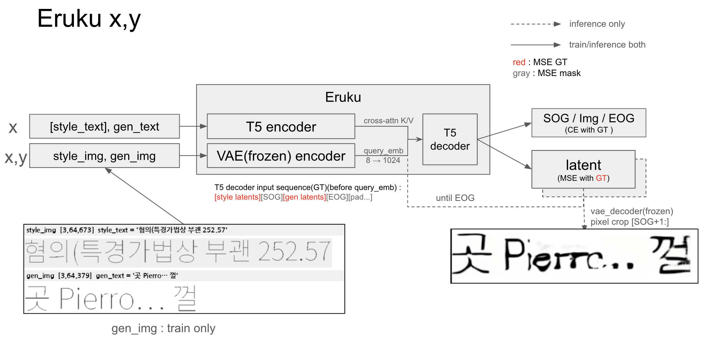

# Eruku Korean Fine-tuning

[](https://huggingface.co/spaces/HERIUN/eruku_korean_demo)
[](https://huggingface.co/HERIUN/eruku_korean)
[](https://huggingface.co/HERIUN/emuru_vae_korean)
[](https://arxiv.org/abs/2510.23240)

[Eruku](https://github.com/Blowing-Up-Groundhogs/Eruku) (autoregressive styled handwriting
generation, [arxiv 2510.23240](https://arxiv.org/abs/2510.23240)) 를 **한글 손글씨 라인
이미지 생성**으로 fine-tuning 하는 프로젝트.

- 목표: 한글 + 영어 + 숫자 + 구두점/특수기호 혼합 **문장 line-text 이미지** 생성
- 방식: 공식 영어 pretrained 에서 출발, 온라인 합성 데이터(폰트=writer)로 fine-tune
- 모델: T5-large + ByT5 tokenizer(한글 byte 처리) + 동결 VAE(`emuru_vae`) + 동결 OrigamiNet(영어 OCR, `alpha=1.0` 으로 loss 미사용)

## ⚠️ 먼저 읽을 것 — 이 모델의 한계

쓰기 전에 알아야 손해를 안 본다. 아래는 전부 이 저장소에서 **측정·기록된** 것이고, 근거는 각 링크에 있다.

| 한계 | 실측 | 어떻게 대처하나 |
|---|---|---|
| **실제 사람 손글씨 스타일은 재현도가 낮다** (writer 다양성 부족도 같은 원인) | 학습 writer 가 전부 **폰트**다 — 한글 **83종** + 라틴 177종(held-out 16종은 평가 전용)이고 pretrained upstream 은 english ~100k writer. 릴리즈 모델은 `online_split`(폰트 합성)으로만 학습했고 실제 손글씨 데이터는 **안 썼다** | 실제 손글씨를 style 로 주면 (bbox 크롭 후) 그 사람 필체와 비슷한 학습된 폰트체로 재현된다. |
| **생성 문구가 짧으면 약하다** | 한글 CER 단문(1~3어절) **0.269** vs 장문(9~15) 0.060 — 4.5배 | 짧은 문구가 목적이면 지금 품질로는 부족. latent 열이 적어 자기회귀 문맥이 모자란 게 원인 |
| **VAE 한글 재구성이 하드상한** | 한글 재구성 오차 = 영어의 **~12배**. 획 밀집 음절(형·꽃·활짝)에서 뭉개짐 | 학습을 늘려도 안 넘는다. 올리려면 VAE 를 손대야 함 ([§3](docs/EXPERIMENTS.md)) |
| **획 하나 차이인 자모끼리 섞인다** — 겹받침 · 쌍자음 · ㅑㅕㅛㅠ | 통제 조건(균등 음절, `experiments/jong_gen_loss.py`) 생성 **오류율**(전부 높을수록 나쁨, 각자의 대조군 대비 배율로 볼 것 — 앞 둘은 자모 단위, 겹받침은 음절 단위라 절대값끼리는 비교 불가): 자모 오류율 **ㅑㅕㅛㅠ 0.260** vs ㅏㅓㅗㅜ 0.135(**1.9배**), **쌍자음 ㄲㄸㅃㅆㅉ 0.166** vs 평자음 0.130(**1.3배**); 음절 오류율 **겹받침 0.507** vs 홑받침 0.289(**1.8배**, = 음절정확도 0.493 vs 0.711). 실제 혼동쌍 상위: ㅆ→ㅅ, ㄻ→ㄹ, ㅓ→ㅕ, ㅑ→ㅏ, ㄺ→ㄹ | 획을 하나 더/덜 그리는 쪽으로 무너진다 — 원인은 자모 종류가 아니라 **글리프 밀도**. 획 하나로 뜻이 갈리는 텍스트(있다/잇다, 사고/사교)는 검수 필요 ([JONGSEONG](docs/JONGSEONG_STROKE_LOSS.md)) |
| **style 이미지에 여백이 있으면 생성이 무너진다** (위와 별개 원인 — 입력 조건 쪽) | 상하좌우 여백(**주로 좌우 마진**)이 latent std 를 폰트(0.014~0.022)의 **6~29배(0.13~0.42)** 로 튀겨 T5 조건이 OOD → runaway/blank. 학습이 글자가 프레임을 꽉 채운 style 만 봐서 "작은 글자 + 큰 여백"을 한 번도 못 봤다 | 스캔이라서가 아니라 **여백 때문**이다 — 여백 없이 잘라 넣으면 스캔도 문제없다. `--bbox-crop`(밀도 기반 잉크 bbox 크롭, 단순 min/max 는 테두리·노이즈에 취약)으로 해결되고 적용 시 4모델×8샘플 32/32 legible ([VAE_ROBUSTNESS](docs/VAE_ROBUSTNESS.md)) |
| **흰 배경 · 검은 글씨만 나온다** | 원인이 **두 겹**이다. ① gen(타깃) 증강 정책 — **흰 배경 강제**, RandomRotation 은 **style 에만**, ColorJitter brightness=0, RandomInvert 비활성. ② **VAE 가 배경을 latent 에 아예 안 싣는다** — `styled RGB → clean B/W` 로 학습됐고 config 부터 `in_channels=3 / out_channels=1`(항등 재구성이면 나올 수 없는 조합) | 종이 질감·색 잉크·배경은 **모델이 못 만든다**. ②때문에 style 이미지에 배경·기울기가 있어도 **VAE encoder 단계에서 벗겨져** 글자 모양만 전달된다(italic 폰트의 기울기는 폰트 자체의 shape 라 재현 가능). 필요하면 생성 후 합성으로 입힐 것 |
| **필압·농담을 못 살린다** | VAE 학습이 **항등 재구성이 아니다** — 입력은 잉크 `alpha∈[0.75,1]`·종이배경·blur·밝기지터를 입힌 `rgb`, 정답은 증강 없는 clean `bw` 이고 loss 가 `\|rec − bw\|`(`train/vae_korean.py:371`, 두 장은 같은 렌더에서 갈라져 **shape 만 공유**). 즉 "흐린 획을 최대 농도로 되돌려라"를 명시적으로 학습한다 | 연필/흐린 획 스타일은 재현 불가. **버그가 아니라 설계**다 — T5 가 회귀할 latent 에서 스타일 노이즈를 걷어내려는 것. 바꾸려면 정답을 농도 보존 이미지로 두고 VAE 재학습 + latent 이동분만큼 T5 재적응(`--reset-vae`)이 따라온다 |
| **생성물 앞머리(첫 글자)가 불안정** | 앞머리에 목표에 없는 글자·artifact 가 붙는 비율 **10.0%**(style_text 사용시) / **26.7%**(빈값). n=60, `experiments/style_echo_check.py` | 예전엔 **style 텍스트 꼬리가 그대로 앞에 붙는** 버그였지만 SOG 기준 크롭으로 잡혔다 — 지금 style 꼬리와 일치하는 잔재는 1.7%(60개 중 1개)뿐이고, 남은 건 앞머리 생성 자체의 불안정이다. **`style_text` 를 채우면 오히려 절반 이하로 준다** |
| **생성이 run-to-run 재현 안 됨** | 같은 입력 2회에 픽셀 maxdiff 221, n=24 CER 0.035/0.031/0.074 | 비교·판정은 **n≥100 페어링**으로만. 단발 수치로 채택/기각 금지 |
| **긴 영어 문장이 약하다** | 한글이 타깃이고 영어는 15% 혼합으로 유지만 한다. 긴 영어에서 반복붕괴 경향([§2](docs/EXPERIMENTS.md) 정성 관찰) | 영어 위주 용도면 원본 `blowing-up-groundhogs/eruku` 를 쓸 것 |

추론 손잡이는 **`drop_text=True`, `cfg_scale` 한글 1.5~2.0, `style_text` 는 가능하면 채우기**가 기본값이다
(자세히는 아래 「추론 파라미터」 절). `style_text` 를 채우면
모델이 style 을 이어 그리므로 크롭은 반드시 SOG 기준이어야 한다 — 저장소 코드와 HF 발행본 모두 반영돼 있다.

## 모델 한 장 요약



**픽셀을 직접 뱉지 않는다.** 높이 64px 라인 이미지[3,64,W]를 동결 VAE 로 가로,세로로 8배 줄인 latent[1,8,W/8]에서
가로 한 열(=원본 8px)을 **토큰 하나**로 보고 T5 디코더가 다음 열을 autoregressive 하게(until EOG) 회귀한다(생성 이미지는 추론단계에서 VAE decoder 가
만든다 학습때는 vae_decoder사용되지 않음). 텍스트는 cross-attention **조건**, 이미지 latent 는 디코더 **입력 시퀀스 그 자체** — 별도
style encoder 가 없고 필체는 이어 쓸 prefix 다. loss 는 latent MSE + special CE 둘뿐이라 학습 중
`vae.decode` 는 아예 안 돈다(출력 화질의 하드 상한이 T5 가 아니라 VAE 인 이유).
그림의 빨간 줄이 디코더 입력 시퀀스이자 GT 이고, 빨강/회색 구분은 **MSE 기준**이다 — CE 는
회색(SOG/EOG/pad)까지 전 위치에 걸린다. 상세는 [`docs/MODULE_IO.md`](docs/MODULE_IO.md).

## 빠른 시작

```bash
git clone https://github.com/HERIUN/Eruku_korean_finetuning.git
cd Eruku_korean_finetuning
uv sync                       # 환경 (torch 2.9+cu128, diffusers/transformers/skimage …)
```

저장소의 **모든 기능은 루트의 세 스크립트**로 부른다. 인자 없이 실행하면 사용법이 나온다.

| | | |
|---|---|---|
| **`./train.sh`** | 학습 · 데이터 생성 | `best` `en2ko` `phase1` `phase2` `vae` `htr` `data` `refset` |
| **`./inference.sh`** | 생성 · 시각화 · 릴리즈 | `best` `hf` `show` `matrix` `echo` `refset` `release` |
| **`./eval.sh`** | 정량 평가 · 감사 · 실험 | `best` `cer` `easyocr` `echo` `all` `fonts` `exp` |

```bash
./train.sh                              # 사용법
./train.sh en2ko --lr 1e-5              # 뒤 인자는 그대로 넘어간다
./train.sh en2ko --help                 # 해당 스크립트의 전체 인자

GPU=2 ./eval.sh best                    # 쓸 GPU (기본 0)
DRY=1 ./train.sh best all               # 실행 않고 커맨드만 출력
```

> 세 스크립트는 얇은 디스패처다. 실제 코드는 `train/` `eval/` `infer/` `tools/` 에 있고
> (`./train.sh phase1` = `python train/phase1.py`), 직접 호출해도 똑같이 동작한다.
> 다만 **`.venv/bin/python`** 으로 실행해야 한다 — 시스템 `python` 엔 의존성이 없다(스크립트는 알아서 쓴다).

### 🎯 현재 best 모델 재현

```bash
./train.sh best status    # 7단계 + 각 산출물이 이미 있는지 표시
./train.sh best all       # 없는 단계만 순서대로 (GPU 수십 시간)
./eval.sh  best           # 재현 검증 — 기대 수치를 같이 출력 (로컬 ckpt 없으면 발행본으로 폴백)
./inference.sh best       # 눈으로 확인 (생성 그리드 PNG)
```

7단계 구성·각 단계 산출물·기대 CER 표·주의사항은 [`docs/REPRODUCE.md`](docs/REPRODUCE.md).
근거 수치는 [`docs/EXPERIMENTS.md`](docs/EXPERIMENTS.md) §4·§5.

### 새로 학습 (best 재현이 아니라 새로 돌릴 때)

```bash
./train.sh data --n 8 --out /tmp/ksplit   # (선택) 데이터 파이프라인 sanity check

# 논문 2-phase: Phase 1(짧은 어절로 glyph) → Phase 2(긴 줄 일반화)
GPU=0 ./train.sh phase1                   # → finetune_runs/korean_p1/
GPU=0 ./train.sh phase2                   # korean_p1/checkpoint_last.pth 에서 resume, +5000 step

# (권장 대안) 영어 pretrained → 바로 한글 긴 줄 — Phase 1 생략, 영어능력 보존
GPU=0 ./train.sh en2ko                    # → finetune_runs/korean_en2ko/

# VAE 한글 적응 (fidelity 하드상한 올리기) — htr 리더 → vae finetune → 교체평가 → T5 재적응
GPU=0 ./train.sh htr && GPU=0 ./train.sh vae
```

왜 2-phase 인지, step·노출량·VRAM·lr 주의, VAE 적응 4단계와 `--train-part`/`--htr-weight` 등
플래그 설명은 [`docs/TRAINING.md`](docs/TRAINING.md).

### 학습 없이 쓰기 (발행본)

`finetune_runs/` 는 gitignore 라 새 클론엔 로컬 `.pth` 가 없다. 하지만 **`--ckpt` 는 로컬 경로와
HF repo id 를 둘 다 받는다** — 파일이 없고 `owner/name` 꼴이면 발행본을 내려받아 그대로 쓴다
(가중치가 로컬 best 와 동일하다, → [`docs/RELEASE.md`](docs/RELEASE.md)).

```bash
./inference.sh hf                                # 발행본 공개 API 로 생성
./inference.sh best                              # 로컬 ckpt 없으면 위로 자동 폴백 (eval.sh best 도)
./eval.sh cer --ckpt HERIUN/eruku_korean         # 평가도 발행본으로
```

### 학습 산출물 (`--out` 디렉토리)

- `train_config.yml` — 실행마다 전체 인자+타임스탬프가 **run 히스토리**로 누적 기록
- `train_loss.csv` — `step,loss,mse,ce,it_s,timestamp` (log-every 마다, resume 시 이어 씀)
- `checkpoint_step_XXXXXX.pth` — model + optimizer + step (resume 용)
- `train_samples/`(+`_en`) — `--save-samples N` 지정 시 학습 데이터 샘플 + montage.
  **모델이 실제로 받는 style 복원 열** 포함(style-len·정규화 fix end-to-end 검증용)
- `val_set.pt` / `val_samples/` — `--val-every>0` 시 **고정 held-out val 세트**(디스크 저장 → run 간 재사용,
  매번 새로 샘플링 안 함). 한글(unseen 폰트)+영어를 `--english-frac` 비율로 섞고, `--val-samples` 로 총량 지정
- `val_loss.csv` — `step,val_loss,val_mse,val_ce,timestamp`
- `truncated_samples.csv` — **절대 truncation 금지 정책**: `max_img_len` 예산 초과로 style/gen 이 잘릴
  샘플은 학습에서 **drop** 하고 여기에 기록(step/종류/길이/텍스트). 몇 개중 몇 개 버렸는지 추적

### 이어 학습 (resume)

```bash
./train.sh phase2 --resume finetune_runs/korean_p2/checkpoint_step_004000.pth --max-steps 200000
```

resume 시 이전 run 의 `train_config.yml` 과 인자가 다르면 `[config WARN]` 으로 알려줍니다
(lr/batch 등 바뀐 채 이어 학습하는 실수 방지).

## 학습 데이터 생성 (온라인 합성, 디스크 0)

디스크에 미리 저장하지 않고 **매 step 새로 합성**한다 (`custom_datasets/korean/split.py`
= 원본 `OnlineSplitFontSquare` 의 한글 서브클래스). 모든 샘플이 unique 인 사실상 무한 데이터셋이고,
한 샘플 = `(style_img, style_text, gen_img, gen_text)` 4-tuple. **폰트 1종 = writer 1명**으로 두어
(style, target) 쌍을 사람 라벨링 없이 무한 생성하는 것이 핵심이다.

- **폰트**: 한글 손글씨/디스플레이 **83종**(`assets/fonts_korean_v2/train/`) + 영어 177종,
  held-out 테스트 16종. 폰트별 charset 캐시로 못 그리는 글자를 애초에 안 뽑아 tofu 방지
- **텍스트**: `MixedLineSampler` 가 한글 0.45 / 영어 0.20 / 숫자 0.20 / **랜덤음절 0.15**(= 논문
  "random words", 코퍼스 빈도편향 없이 전 음절 노출) 를 섞고 구두점·특수기호를 붙여 1줄 합성
- **원본 대비**: style/gen 을 **따로 렌더**(경계 침범 제거), **RandomWarping 제거 · RandomInvert
  비활성**, RandomRotation 은 **style 에만**, gen 배경 **흰색 강제** — 출력이 흰배경·곧은 글자인 이유

```bash
uv run python custom_datasets/korean/split.py --n 8 --out /tmp/ksplit   # 샘플 8쌍 + montage
```

폰트 목록·샘플러 비중·증강 정책 전체·논문 레시피 매핑(`p_uncond`/`p_drop`/virtual batch 256)은
[`docs/DATA_GENERATION.md`](docs/DATA_GENERATION.md) §8.

### 📄 파이프라인 상세 문서 & 알려진 이슈 (`docs/`)
- **`docs/EXPERIMENTS.md`** — 📊 **측정 로그 전문**(§1~§7): 초기 실험 → echo 정량 → VAE 한글
  수용성 → VAE 적응 ablation → Eruku 재적응 → 강건성 → 종성 획 손실. 아래 「결과 요약」의 근거.
- **`docs/MODULE_IO.md`** — 🧩 **학습 모듈 I/O 총정리**(위 「한 장 요약」 그림의 상세판): 배치 dict 6개 키(무엇을 넣어야 하나),
  `style_len`/`gen_len` 이 왜 이미지에서 못 얻는 값인지, 텍스트가 T5 encoder 로 들어가는 경로,
  `forward`(loss+pred_latent) / `generate`(라인 이미지) 출력까지 **실제 생성 이미지**로 설명.
  - 재현: `CUDA_VISIBLE_DEVICES=2 PYTHONPATH=. .venv/bin/python docs/_gen_module_io.py`
- **`docs/DATA_GENERATION.md`** — 데이터 생성 전체 흐름(코드 단위). §1~§7 원본 `OnlineSplitFontSquare`,
  **§8 한글판**(폰트 83종·`MixedLineSampler` 비중·증강 정책 변경·논문 레시피 매핑).
- **`docs/RELEASE.md`** — HF 릴리즈 발행 절차·검증. ⚠️ **릴리즈 클래스와 학습 클래스의 style
  prefix 크롭 규약이 다르다**(섞어 쓰면 이중 크롭으로 생성물이 날아감) + 2026-08 echo 패치 CER 실측.
- **`docs/REPRODUCE.md`** — 🎯 **best 모델 재현 7단계**: 각 단계 산출물, `./eval.sh best` 가
  대조할 기대 CER 표, 3·4단계를 건너뛰어도 되는 이유.
- **`docs/TRAINING.md`** — 🏋 **새로 학습할 때의 레시피**: 2-phase 근거, virtual step·노출량·
  VRAM·lr 주의, VAE 한글 적응 4단계와 플래그(`--train-part`/`--htr-weight`/`--pyramid-*`).
- **`docs/PIPELINE_STEP_BY_STEP.md`** — 렌더→증강→split 을 단계별 이미지로 시각화.
  긴 텍스트에서 ①회전(`expand=False`)이 양끝을 잘라내고 ②warp 가 split cut 을 글자로 밀어넣는
  문제를 실측·정리(파이프라인은 **2~3어절 짧은 라인 가정** 위에서만 안전).
- **`docs/STYLE_LEN_BUG.md`** — ⚠️ **`get_model_inputs` 단위 버그**: `sl`(픽셀)을
  `style_img_embeds.shape[-1]`(latent=픽셀/8)과 그대로 `min` 비교해 **style/gen 이 실폭의 ~1/8
  (≈글자 1개)로 잘려** 조건으로 들어가던 문제. `* 8` 로 픽셀 환산해 수정(사용률 ~10% → ~100%,
  실측·before/after 이미지 포함). **이 수정 이전 체크포인트는 style 을 거의 못 봤으므로 재학습 권장.**
  - 재현: `PYTHONPATH=. uv run python docs/_verify_style_len.py` (사용률 ~100% 확인)
- **`docs/JONGSEONG_STROKE_LOSS.md`** — ⚠️ **종성(받침) 획 손실 진단·개선 로그 (진행 중)**.
  겹받침 음절정확도가 홑받침보다 22%p 낮은 원인을 VAE/T5 로 분해한 측정과 통제 실험 기록.

## 추론 파라미터: CFG · drop_text · style_text (중요)

생성 품질에 크게 영향을 주는 세 손잡이. 셋은 **서로 직교**하며 역할이 다르다.

### `drop_text` — CFG 켜는 스위치 (추론 시 반드시 `True`)

CFG(classifier-free guidance)는 매 스텝 **텍스트 있는 forward(cond)** 와 **텍스트 없는 forward(uncond)** 를
계산해 `out = uncond + (cond - uncond) * cfg_scale` 로 외삽한다. `drop_text` 는 그 uncond 분기가
무엇을 쓸지 결정한다:

- `drop_text=True` → uncond 가 **학습된 `uncond_embedding`("텍스트 없음" 벡터, 전체 토큰을 이 벡터로 대체)** 사용
  → `cond ≠ uncond` → CFG 작동.
- `drop_text=False` → uncond = cond → `out = cond + 0` → **CFG 무효**(cfg_scale 무시, forward 만 2배 낭비).

학습 때 text-dropout 으로 `uncond_embedding` 을 배워두므로, 추론에서 이걸 켜야(`True`) 그 표현을 활용한다.
CFG 를 안 쓸 때(`cfg_scale=1.0`)는 uncond forward 자체를 안 하므로 `drop_text` 는 무의미하다.

> ⚠️ upstream `blowing-up-groundhogs/eruku` 의 릴리즈 `modeling_eruku.py` 는 `drop_text=False` 가 기본이라
> `cfg_scale=1.25` 를 줘도 CFG 가 **무효**다(영어 in-domain 이라 CFG 없이도 선명해 티가 안 남). 한글 파인튜닝은
> CFG 증폭이 없으면 생성이 흐려지므로(예: 특정 스타일에서 거의 백지), 이 포크·HF 패키지는 `drop_text=True` 로 수정.

### `cfg_scale` — guidance 강도

클수록 텍스트 조건에 강하게 의존(진하고 또렷). 한글은 **1.5~2.0 권장**(원본 기본 1.25보다 높게).

### `style_text` — style 이미지의 전사 (넣으면 정확도 크게↑)

style 참조 이미지의 전사 텍스트. `f"{style_text}<sog>{gen_text}"` 로 gen_text 와 합쳐져 텍스트 조건이 된다.
**빈값("")이어도 동작**하지만(학습 시 `style_text_dropout=0.10` 으로 무전사 강건성 학습), **내용 정확도가
눈에 띄게 떨어진다.** held-out 폰트 CER(n=40, `drop_text=True` 동일 조건) 실측:

| style_text | gen CER↓ | 모델 오류(gap)↓ |
|---|---|---|
| 제공 | **0.197** | 0.063 |
| 빈값 "" | 0.474 | 0.340 |

가능하면 style 이미지의 실제 전사를 넣을 것. (단 위 echo 측정은 전사=목표라 best-case이며, 실사용
전사≠생성텍스트에선 이득이 이보다 작다.) `drop_text` 와는 무관 — 빈값이라고 `drop_text` 를 바꿀 필요 없다.

> ⚠️ **`style_text` 를 채우면 모델이 style 을 '이어서 그린다'(echo) — 크롭은 반드시 SOG 기준으로.**
> `generate()` 는 `style_text` 가 **비어 있지 않으면 SOG 를 디코더에 넣지 않는다**(모델이 스스로 내야 한다).
> 그래서 모델은 SOG 를 낼 때까지 style 텍스트를 계속 그리고, 그 사이 생성된 IMG 토큰마다 latent 열이 쌓인다.
> `style폭+1` 같은 **고정 오프셋으로 자르면 그 echo 가 결과 앞에 그대로 남는다**(gen_text 에 없는 글자가 앞에 붙는
> 증상). 실측: 폰트 6종에서 echo 누수 160~280px, 중앙값 80px·최대 2661px.
> 올바른 경계는 `generate` 가 돌려주는 special 시퀀스의 **첫 SOG 열**이다(`infer.show.gen_arr` 규약).
> `style_text=""` 경로는 SOG 가 강제 주입돼 echo 가 0 이라 이 버그가 안 보인다.

### 요약

| 손잡이 | 역할 | 권장 |
|---|---|---|
| `drop_text` | CFG 켬/끔 | 추론 시 **항상 True** |
| `cfg_scale` | guidance 강도 | 한글 **1.5~2.0** |
| `style_text` | 텍스트 조건에 전사 포함 | **가능하면 채우기** (정확도↑) |

## 추론 / 시각화

```bash
# 0) style ref 세트 — 뷰어들이 이걸 style 로 쓴다 (data/ 는 gitignore 라 새 클론이면 먼저 생성)
./inference.sh refset --per-font-train 5 --per-font-val 0 --no-augment --out data/ref_set_clean

# 1) 가장 빠른 확인: best 모델로 생성 그리드 → _debug/best_show.png
./inference.sh best
./inference.sh best "쓰고 싶은 문장 2024년"
#    로컬 ckpt(finetune_runs/…, gitignore)가 없으면 자동으로 아래 HF 릴리즈 경로로 넘어간다.

# 1') 로컬 ckpt 없이 — 발행된 HF 릴리즈(공개 API)로 생성
./inference.sh hf                                   # HERIUN/eruku_korean + 페어 VAE 자동 다운로드
./inference.sh hf --style-image my_handwriting.png --style-text "전사" --bbox-crop

# 2) 직접 지정: [스타일 ref | 정답 예시 | 생성 cfg=...]
./inference.sh show \
  --ckpt finetune_runs/korean_p2/checkpoint_step_020000.pth \
  --lines-json data/ref_set_clean/train_lines.json \
  --seed-text "오늘 날씨가 좋아서 친구와 공원에서 커피를 마셨다 2024년" \
  --cfgs 1.0 1.25 1.5 1.75 2.0 --n-writers 4 --out _debug/show.png

# 3) 스타일 × 텍스트 매트릭스 / 모델 나란히 비교
./inference.sh matrix --ckpt <ckpt> --out _debug/matrix.png
./inference.sh echo   --out _debug/echo.png

# style 텍스트(ref 전사) 제공 여부:
#   기본        → style ref 의 텍스트를 조건으로 함께 줌
#   --no-style-text → style 이미지만으로 스타일 파악(전사 미제공). 컬럼 라벨에 (no-stext) 표시.
#   둘을 비교하려면 같은 인자로 두 번 실행(--out 만 다르게):
./inference.sh show --ckpt ... --out _debug/show_stext.png
./inference.sh show --ckpt ... --out _debug/show_nostext.png --no-style-text
```

## 평가

```bash
./eval.sh best                        # best 모델 재현 검증 (한글+영어, 기대 수치 대조)
./eval.sh cer  --ckpt <ckpt> --n 100 --coherent            # 한글 주 지표 (HTR CER)
./eval.sh cer  --ckpt <ckpt> --n 100 --coherent --english  # 영어
./eval.sh echo --ckpt <ckpt>          # echo 정량 (MSE/SSIM/LPIPS/FID)
./eval.sh all  --models a=<ckptA> b=<ckptB> --coherent     # 여러 모델 × ko/en 배터리
./eval.sh fonts                       # 폰트 품질 감사 (두부·malformed 글리프)

./eval.sh exp                         # 일회성 실험 스크립트 목록
./eval.sh exp jong_stroke_loss --n-lines 120   # experiments/jong_stroke_loss.py 실행
```

## repo 구조

```
# 진입점 (루트에는 이 3개만)
train.sh                   # 학습·데이터: best|en2ko|phase1|phase2|vae|htr|data|refset
inference.sh               # 생성·시각화·릴리즈: best|hf|show|matrix|echo|refset|release
eval.sh                    # 평가·감사·실험: best|cer|easyocr|echo|all|fonts|exp
# 설정  (데이터 합성 ~ 학습 파라미터 전부, CLI > yaml > 코드 기본값)
configs/base.yaml          # ★ 조절 가능한 전체 항목 + 기본값 (주석 포함, 여기부터 보면 됨)
configs/phase1.yaml        # 논문 Phase 1 레시피 / phase2.yaml / korean_from_en.yaml
configs/README.md          # 우선순위·상속·새 인자 추가법
# 학습
train/core.py              # 학습 공통 코어 (make_parser 인자 정의 + 학습 루프)
train/config.py            # yaml 로더 (_base_ 상속, CLI 덮어쓰기, 오타 키 거부)
train/phase1.py            # Phase 1 진입점 = configs/phase1.yaml 을 무는 얇은 래퍼
train/phase2.py            # Phase 2 진입점 (긴 줄, resume, +5000 step)
train/korean_from_en.py    # 영어 pretrained → 한글 직접 (Phase 1 생략)
train/eruku_continous.py   # (원본 repo 스타일 트레이너: wandb/accelerate/webdataset 기반, 참고용)
train/vae_korean.py        # VAE 한글 적응 finetune (--train-part dec|full, htr/pyramid/logvar 항)
train/aux_htr.py           # 한글 HTR 리더 finetune (VAE 의 HTR loss + 평가 리더 겸용)
# 데이터  (상세: docs/DATA_GENERATION.md §8)
custom_datasets/korean/split.py    # 온라인 한글 split 데이터셋 (+ CLI 샘플 덤프, --show-model-input)
custom_datasets/korean/fontset.py  # 오프라인 라인 생성기 + MixedLineSampler/build_pools (공용)
custom_datasets/korean/aux.py     # HTR 학습용 (라인이미지, 전사) 데이터셋 + alphabet.py
custom_datasets/upstream/  # 원본 repo 코드 vendored (수정 금지 — upstream/README.md 참고)
custom_datasets/korean/    # 이 repo 추가분 (upstream 을 import, 역방향 없음)
custom_datasets/hw_line_sample/    # 실제 손글씨 라인 20장 + label.txt (미러링/복원 평가용)
tools/                     # font_audit(폰트 품질 감사) · fetch_aux · hf_upload(HF 릴리즈)
# 추론 / 평가  (infer/show.py 가 공유 라이브러리: load_model/gen_arr/render_in_font …)
infer/release.py           # 발행된 HF 릴리즈(공개 API)로 생성 — 로컬 ckpt 불필요
infer/show.py              # 자기설명적 결과 뷰어 [스타일ref|정답|생성 cfg…] (--exclude-writers 로 폰트 제외)
infer/matrix.py            # 스타일×텍스트 매트릭스 뷰어 / echo_compare.py  모델 나란히 비교
eval/htr_cer.py            # 생성 CER (한글 HTR 리더, 렌더바닥 ~0.00) ← 한글 주 지표
eval/cer.py                # echo CER (easyocr — 한글은 saturated, 교차검증용)
eval/echo_metrics.py       # echo 정량 (MSE/SSIM/LPIPS/FID) / all.py  통합 배터리
# 모델
models/eruku.py            # Emuru 모델 (forward/generate) — style-len 단위버그 수정됨
models/                    # + OrigamiNet, VAE, HTR
# 그 외
experiments/               # 일회성 실험 스크립트 (vae_* / gen_* / jong_* / style_echo_check …)
                           #   결론은 전부 docs/EXPERIMENTS.md 에 기록됨. 어느 cwd 에서든 실행 가능
docs/                      # 상세 문서 + 재현 스크립트·이미지
assets/                    # fonts_korean_v2(train 83 / test 16) · fonts_english(177) ·
                           #   custom_hw_fonts(held-out 4) · backgrounds · corpus · korean_charset.json
                           #   + download_script/(Google Fonts 수집) · font_view/(폰트 오버뷰)
```

### 폰트 오버뷰 (어떤 글씨체인지 한눈에 보기)

```bash
uv run python assets/font_view/render_overview.py    # assets 폰트 폴더 전체 → assets/font_view/overview_*.png
uv run python assets/font_view/render_overview.py --dirs assets/fonts_korean_v2/test   # 특정 폴더만
```

폴더별 montage PNG 생성: 행마다 [파일이름 + 지원 글자수 분류(전체/한글/한자/영문/숫자/기호/기타) |
샘플 1줄 렌더(한글+영어 대/소문자+숫자+특수기호)]. 폰트 추가/교체 후 다시 실행하면 갱신됨.

## 결과 요약

측정 로그 전문(표·재현 커맨드·중간 실험)은 [`docs/EXPERIMENTS.md`](docs/EXPERIMENTS.md) 에 있다.
여기엔 **지금 코드·체크포인트에 반영된 결론만** 남긴다.

| 주제 | 결론 | 상세 |
|---|---|---|
| 학습률 | 영어 pretrained init 에서 **lr 5e-5 발산**(virtual batch 256 기준 1e-4). lr 은 virtual batch 에 맞출 것 | [§1](docs/EXPERIMENTS.md) |
| 한글 fidelity 상한 | 동결 VAE 의 **한글 재구성이 하드상한** — 한글 오차가 영어의 **~12배**. 학습을 늘려도 안 넘는다 | [§3](docs/EXPERIMENTS.md) |
| VAE 한글 적응 | `--train-part full` + `--htr-weight 0`(pure-L1) 이 최선. roundtrip MSE **−83%**. pyramid/HTR/logvar 항은 이득 없음 | [§4](docs/EXPERIMENTS.md) |
| Eruku 재적응 | full VAE 는 latent 가 이동 → T5 재적응 필수. 단문강조 재적응으로 한글 CER **0.211 → 0.127**, 단문 **0.54 → 0.29** | [§5](docs/EXPERIMENTS.md) |
| VAE 강건성 | 실제 스캔 손글씨는 **여백이 latent std 를 6~29배**로 튀겨 runaway → ink bbox 크롭 필요(재학습 불필요) | [VAE_ROBUSTNESS.md](docs/VAE_ROBUSTNESS.md) |
| 종성 획 손실 | 겹받침 음절정확도가 홑받침보다 **22%p** 낮다. 원인은 받침 개수가 아니라 **글리프 밀도**(조사 진행 중) | [JONGSEONG_STROKE_LOSS.md](docs/JONGSEONG_STROKE_LOSS.md) |
| 지표 선택 | 픽셀 지표(MSE/SSIM)는 글자 정렬오차에 민감·언어간 비교 부적절. **한글 주 지표는 HTR CER**(`eval/htr_cer.py`) | [§2](docs/EXPERIMENTS.md) |

**현재 best 체크포인트**: `finetune_runs/eruku_short_fullmse/checkpoint_step_030000.pth`
(한글 전체 CER 0.127 / 단문 0.286 / 장문 0.059, 영어 0.045 — n=100, cfg=1.0, coherent).
val_mse 는 s20000 이 더 낮지만 생성 CER 은 s30000 이 낫다 — **ckpt 선택은 val_mse 가 아니라 CER 로**.

> 실행 환경 주의: 이 repo 는 **`.venv/bin/python`** 으로 실행한다(torch 2.9+cu128,
> diffusers/skimage/transformers 포함). 시스템 `python`(miniconda base)에는 numpy 조차 없다.

## HuggingFace 릴리즈

✅ **2026-08-14 발행 완료.** 최고 조합을 **repo 2개**로 발행한다 — VAE 가중치를 상위 repo 가
`AutoencoderKL.from_pretrained(config.vae_name_or_path)` 로 **원격 로드**하므로 분리가 필수다.

| repo | 내용 |
|---|---|
| [`HERIUN/eruku_korean`](https://huggingface.co/HERIUN/eruku_korean) | T5 + proj + 특수토큰 (`model.safetensors`) + remote code(`modeling_eruku.py`) |
| [`HERIUN/emuru_vae_korean`](https://huggingface.co/HERIUN/emuru_vae_korean) | 한글 적응 VAE (diffusers `AutoencoderKL`) |
| [`HERIUN/eruku_korean_demo`](https://huggingface.co/spaces/HERIUN/eruku_korean_demo) | 🤗 Space — 브라우저에서 바로 써보는 gradio 데모 |

```python
from transformers import AutoModel
from PIL import Image
m = AutoModel.from_pretrained("HERIUN/eruku_korean", trust_remote_code=True).eval().cuda()
img = m.generate_handwriting(style_image=Image.open("style_line.png"),
                             style_text="조용히 책을 읽었다.",   # style 전사(주면 정확도↑)
                             gen_text="한국어 손글씨 생성", cfg_scale=1.5)
```

`bbox_crop=True` 는 스캔 손글씨의 여백이 latent 를 OOD 로 밀어내는 문제의 추론측 해결책이다
(→ [`docs/VAE_ROBUSTNESS.md`](docs/VAE_ROBUSTNESS.md) ②). ⚠️ **릴리즈 경로는
`generate_handwriting` 하나로만 쓸 것** — 로컬 `infer.show.gen_arr` 크롭을 겹치면 이중 크롭으로
생성물이 날아간다. 발행 절차(`tools/hf_upload.py`)·검증 수치·규약 차이 전체는
[`docs/RELEASE.md`](docs/RELEASE.md).

## 요구 사양

- CUDA GPU ≥ 24 GB (batch 2, max-img-len 2048 기준; T5-large 705M trainable).
  VAE 적응(`train/vae_korean.py` batch 8 × accum 4)은 ~20 GB, 한글 HTR(`train/aux_htr.py`)은 ~10 GB
- 디스크: repo ~250 MB + pretrained 2.9 GB(자동 다운로드) + 학습 ckpt 개당 ~8 GB
- TPS C++ 백엔드는 선택 (`custom_datasets/upstream/font_square/tps/build.sh`, `uv sync --extra tps` 후) — 없으면 NumPy fallback 으로 동작
