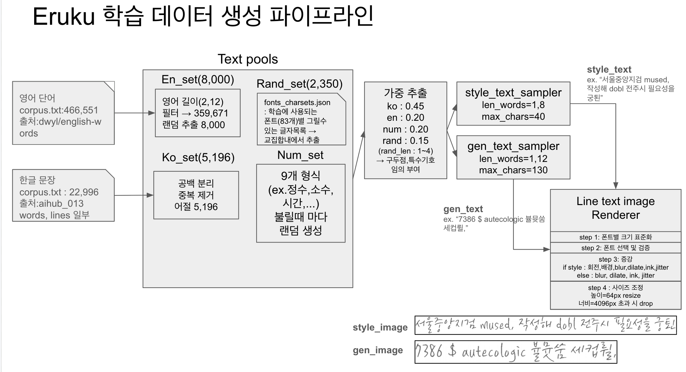

# Eruku 학습데이터 생성 방식 (코드베이스 기반 정리)

원본 repo: <https://github.com/Blowing-Up-Groundhogs/Eruku>

Eruku(=Emuru 계열)는 **손글씨/폰트 스타일 전이(style transfer)** 모델이다. 학습에 필요한
`(스타일 이미지, 목표 텍스트, 목표 이미지)` 쌍을 사람이 손으로 라벨링하지 않고,
**폰트를 "필자(writer)"로 간주하여 텍스트를 실시간으로 렌더링·증강**하는 방식으로 무한 생성한다.

이 문서는 그 생성 파이프라인을 코드 단위로 설명한다.
**§1~§7 은 원본 upstream, [§8](#8-한글판-koreansplitfontsquare--여기서부터가-이-저장소) 부터가 이 저장소의 한글판**(폰트 목록·`MixedLineSampler` 비중·증강 정책 변경·논문 레시피 매핑)이다.

---

## 0. 두 개의 층: "온라인 합성" vs "미리 렌더된 tar"

원본 repo에는 데이터가 들어오는 경로가 두 가지 있는데, **근본 생성 로직은 하나**다.

| 경로 | 사용처 | 설명 |
|------|--------|------|
| **미리 렌더된 WebDataset** | 원본 대규모 사전학습(`train/eruku_continous.py`) | `font-square-pretrain-20M/{000000..002291}.tar` (2,292개 shard, 약 2천만 샘플)을 `wds.WebDataset`으로 읽음. 이미 렌더·증강된 PNG가 tar 안에 들어있음 |
| **온라인 합성 (OnlineFontSquare)** | 그 20M tar를 **만드는 원천 로직** / 파인튜닝 / 소규모 실험 | `custom_datasets/upstream/font_square/` 의 Dataset이 `__getitem__` 호출 때마다 즉석에서 텍스트 샘플링 → 폰트 렌더 → 증강 |

즉 tar는 결국 `OnlineFontSquare(_Split)` 파이프라인의 출력을 캐싱한 것이다.
**"학습데이터를 어떻게 만드는가"의 본질은 `custom_datasets/font_square` 파이프라인**이므로 이 문서는 그것을 다룬다.

---

## 1. 관련 파일 지도

```
custom_datasets/
├─ constants.py            # 특수토큰(PAD/SOS/EOS), FONT_SQUARE_CHARSET(라틴+기호 173자)
├─ alphabet.py             # 문자 ↔ 정수 인덱스 인코더 (Alphabet)
├─ subsequent_mask.py      # 디코더용 causal mask
└─ font_square/
   ├─ render_font.py       # Render: 폰트 1개로 텍스트 → numpy 이미지 (폰트크기 캘리브레이션 포함)
   ├─ font_square.py       # OnlineFontSquare(단일 텍스트) + TextSampler / GibberishSampler / FixedTextSampler + collate_fn
   ├─ font_transforms.py   # 단일 텍스트용 증강 transform 모음
   ├─ font_square_split.py # OnlineSplitFontSquare(style+gen 두 텍스트를 한 줄에) ← Eruku 실제 학습에 쓰는 형태
   ├─ font_transforms_split.py # split용 증강 transform (RenderImage가 style|gap|gen 합성)
   └─ tps/                 # Thin-Plate-Spline 워핑 C++/Python 구현 (RandomWarping이 사용)
```

핵심 두 클래스:
- **`TextSampler`** — 무엇을 쓸지(텍스트) 정한다.
- **`OnlineFontSquare` / `OnlineSplitFontSquare`** — 그 텍스트를 어떤 폰트로, 어떻게 렌더·증강할지 정한다.

---

## 2. 단계 ①: 텍스트 샘플링 (`TextSampler`)

`font_square.py:239` (`font_square_split.py:257` 동일). 렌더할 문자열을 확률적으로 생성한다.

### 2-1. 단어 사전 구축 (`load_words`)
- 최초 1회, NLTK 코퍼스 6종을 합쳐 단어 사전을 만들고 `words_dict.msgpack`으로 캐싱한다.
  ```python
  words  = nltk.corpus.abc.words()
  words += nltk.corpus.brown.words()
  words += nltk.corpus.genesis.words()
  words += nltk.corpus.inaugural.words()
  words += nltk.corpus.state_union.words()
  words += nltk.corpus.webtext.words()
  ```
- 중복 제거 후 고유 단어 목록 확보 (`font_square.py`는 103,452개, `_split`은 103,411개를 assert로 고정 — 재현성 검증용).
- `charset`이 지정되면 그 문자로만 이루어진 단어만 남긴다.

### 2-2. 단어 가중치 (자주 안 나오는 글자를 더 자주 뽑기)
단순 빈도가 아니라 **희귀 문자/바이그램에 가중**을 준다 (드문 글자도 학습되도록):
```python
# 등장할수록 가중치↓ (역빈도). exponent로 강도 조절
self.unigram_counts[c] = 전체길이 / (빈도 ** exponent)
self.bigram_counts[bg] = 전체길이 / (빈도 ** exponent)
# 단어 점수 = (평균 unigram 점수 + 평균 bigram 점수)/2  → words_weights
```
`eval_word()`가 각 단어에 점수를 매기고, 이 점수가 샘플링 확률(`words_weights`)이 된다.

### 2-3. 한 샘플 뽑기 (`__call__`)
```python
words_count = random.randint(min_count, max_count)          # 어절 수 랜덤
idx = torch.multinomial(self.words_weights, words_count, replacement=True)  # 가중 샘플링
txt = ' '.join(self.words[i] for i in idx)                  # 공백으로 연결
# 길이 보정: 너무 짧으면 공백 패딩, 너무 길면 자름
if len(txt) < min_len: txt += ' ' * (min_len - len(txt))
if len(txt) > max_len: txt = txt[:max_len]
```

**핵심 하이퍼파라미터**
| 인자 | 의미 |
|------|------|
| `count` (int 또는 (min,max)) | 한 줄에 넣을 **어절 수** |
| `min_len`, `max_len` | 결과 문자열 **글자 수** 하한/상한 |
| `exponent` | 희귀문자 가중 강도 |
| `charset` | 허용 문자 집합 (사전 필터링) |

### 2-4. 대체 샘플러
- **`GibberishSampler`** (`:318`) — 실제 단어가 아니라 charset에서 문자를 랜덤 추출(공백 확률 16%로 가장 높음). 모델이 "언어"가 아니라 "글자 모양"을 배우게 하는 무의미 문자열용.
- **`FixedTextSampler`** (`:343`) — 항상 같은 문자열 반환(추론/디버깅용).

> 참고: 이 fork의 한글 버전은 `TextSampler` 대신 `custom_datasets.korean.fontset.MixedLineSampler`(한글 음절+영어단어 혼합 라인 샘플러)를 끼워 넣는다(`custom_datasets/korean/split.py:126 build_samplers`). 샘플러만 교체될 뿐 렌더·증강 골격은 동일하다.

---

## 3. 단계 ②: 폰트 렌더링 (`Render`)

`render_font.py:19`. 폰트 파일 1개 = "필자 1명"에 대응한다.

### 3-1. 폰트 로딩 & 크기 캘리브레이션 (`calibrate`)
폰트마다 실제 글자 크기가 제각각이라, 목표 높이 대비 일정 비율(threshold)을 차지하도록 `font_size`를 자동 조정한다.
```python
while self._perc(text, h, w) > threshold: font_size -= 1   # 너무 크면 줄이고
while self._perc(text, h, w) < threshold: font_size += 1   # 너무 작으면 키움
```
결과(폰트별 최적 크기)는 `fonts_sizes.json`에, 폰트가 지원하는 문자집합은 `fonts_charsets.json`에 캐싱된다(`make_renderers`가 로드). → 다음 실행부터 캘리브레이션 생략.

### 3-2. 렌더 (`render`)
- `charset`이 있으면 폰트가 못 그리는 글자를 먼저 제거.
- PIL `ImageDraw.text`로 흰 배경(1)에 검은 글자(0)를 그림.
- **앵커 위치** `action`: `top_left`(학습 파이프라인 기본), `center`, `center_left`, `random`(위치 지터).
- 반환: `(numpy 흑백 이미지, 실제 렌더된 텍스트)`.

### 3-3. 폰트 렌더러 대량 로딩 (`make_renderers`)
- 폰트 디렉토리를 rglob으로 훑어 `.ttf/.otf/.ttc` 전부를 `Render` 인스턴스로 만든다(단일버전은 스레드풀 병렬).
- 로드 실패 폰트는 걸러내고, 지원 문자 수가 많은 순으로 정렬, 최대 100,000개까지 사용.
- 이 renderer 리스트의 **인덱스가 곧 `font_id`(=writer id)** 가 된다.

---

## 4. 단계 ③: 증강 파이프라인 (transform Compose)

`OnlineSplitFontSquare.__init__`(`font_square_split.py:178`)에서 정의. `torchvision.Compose`로 아래 순서대로 적용된다. 각 transform은 `sample` dict를 받아 갱신한다.

| 순서 | Transform | 하는 일 |
|------|-----------|---------|
| 1 | **RenderImage**(pad=20) | `font_id`의 폰트로 style/gen 텍스트를 각각 렌더 → **`[style | 20px 흰간격 | gen]`** 로 가로 이어붙임. style/gen 경계 폭(`style_img_width` 등)을 기록 |
| 2 | RandomRotation(3°, p=0.5) | ±3도 회전 |
| 3 | **RandomWarping**(grid 5×2, p=0.5) | **TPS(Thin-Plate-Spline)** 로 격자를 랜덤 변형 → 손글씨 같은 자연스러운 휨. `tps/` C++ 확장 사용 |
| 4 | GaussianBlur(k=3, p=0.5) | 흐림 |
| 5 | **RandomBackground**(white_p=0.1) | 배경 이미지 폴더에서 랜덤 패치를 잘라 배경으로 사용(상하/좌우 랜덤 플립). 10% 확률로 흰 배경 |
| 6 | TailorTensor(pad=3) | 글자가 있는 영역(bbox)으로 크롭, 여백 3px |
| 7 | **SplitAlphaChannel** | 글자를 알파(잉크 투명도 0.5~1.0 랜덤)로 분리, `text_img = 1 - 흑백` 생성 |
| 8 | GrayscaleDilation(k=2, p=0.1) | 획 두껍게(팽창) |
| 9 | ColorJitter(0.05, p=0.5) | 밝기/대비/채도 미세 변화 |
| 10 | RandomInvert(p=0.2) | 배경 명암 반전 |
| 11 | **ImgResize(64)** | 높이 64px로 리사이즈(비율 유지) — 모델 입력 규격 |
| 12 | **MergeWithBackground** | `text_img*alpha` 를 배경 위에 합성 → 최종 컬러 `img` |
| 13 | Normalize(0.5, 0.5) | `[-1,1]` 정규화 (bg/img/text_img 모두) |

> `RandomInvert`(반전)는 곱셈 합성에서 정보가 없어 fork에서는 비활성화하기도 함(주석 참고). 각 transform의 확률(`p`)과 강도가 이 데이터셋의 "다양성 다이얼"이다.

산출되는 `sample`의 주요 키: `img`(합성 컬러), `text_img`(잉크 마스크), `bg_patch`(배경), `style_img_width`/`gen_img_width`/`total_img_width`(경계 폭).

---

## 5. 단계 ④: 한 샘플의 최종 형태 (`__getitem__`)

`OnlineSplitFontSquare.__getitem__`(`font_square_split.py:206`):
```python
font_id = font_id % renderers_length          # 폰트 순환
style_text, gen_text = text_sampler(), text_sampler()   # 서로 다른 두 텍스트
sample = self.transform({'style_text':..., 'gen_text':..., 'font_id':...})
# 이어붙인 이미지를 경계폭 기준으로 다시 style/gen 파트로 분리
style_img_width = sample['style_img_width'] * W // total_img_width
return {
  'style_text_img': text_img[..., :style_img_width],   # 스타일 참조(잉크)
  'gen_text_img'  : text_img[..., style_img_width:],    # 생성 목표(잉크)
  'style_img'     : img[..., :style_img_width],         # 스타일 참조(컬러)
  'gen_img'       : img[..., style_img_width:],         # 생성 목표(컬러) = 정답
  'style_text', 'gen_text', 'writer': font_id, ...
}
```
- **한 폰트(writer)로 style/gen 두 텍스트를 같은 스타일로 렌더** → 모델은 style 파트에서 스타일을, gen_text에서 내용을 받아 gen_img를 재현하도록 학습된다. 이것이 style transfer 학습쌍의 핵심.
- 단일버전 `OnlineFontSquare`(`font_square.py:205`)는 style/gen 구분 없이 텍스트 1개만 렌더하고, `Alphabet.encode`로 CTC/S2S 로짓(`text_logits_ctc`, `text_logits_s2s = [SOS]+ctc+[EOS]`)까지 만든다(인식기/보조손실용).

### 배치 묶기 (`collate_fn`)
`font_square.py:37`. 가변 폭 이미지를 **너비 축으로 pad_sequence** 하여 배치화하고(`pad_images`), 라벨 로짓을 PAD로 패딩, 디코더용 `tgt_key_mask`(causal)·`tgt_key_padding_mask` 를 만든다. `HFSplitDataCollector`(`:235`)는 HuggingFace 학습 루프용 변형(style_img/gen_img을 3채널 반복해 반환).

---

## 6. 실제로 데이터셋을 구성하는 코드 (인스턴스화)

원본/파인튜닝 공통 패턴:
```python
from custom_datasets.font_square.font_square_split import OnlineSplitFontSquare, TextSampler

sampler = TextSampler(min_len=None, max_len=None, count=(1, 3),  # 1~3어절
                      words_dict_path='files/font_square/words_dict.msgpack')

ds = OnlineSplitFontSquare(
        fonts='assets/fonts',            # 폰트 디렉토리(=writer 풀)  → 인덱스가 font_id
        backgrounds='assets/backgrounds',# 배경 이미지 폴더
        text_sampler=sampler,
        length=None)                     # None이면 len = 폰트 수
# DataLoader(ds, collate_fn=collate_fn, ...) 로 학습
```
- **필요한 3대 입력 자산**: ① 폰트 폴더, ② 배경 이미지 폴더, ③ 단어사전 msgpack(없으면 NLTK로 자동 생성).
- 부수 캐시: `fonts_sizes.json`(폰트별 캘리브 크기), `fonts_charsets.json`(폰트별 지원 문자).
- `length`를 크게 주면 `font_id = idx % 폰트수`로 폰트를 계속 순환하며 매번 새로운 텍스트/증강 조합을 뽑으므로 사실상 **무한 데이터**가 된다.

원본 대규모 사전학습은 위 파이프라인 출력을 미리 렌더해 `*.tar`(WebDataset) 2,292개로 저장해 두고, `train/eruku_continous.py`가 `wds.WebDataset(TRAIN_PATTERN).decode("pil")`로 읽어 배치(BATCH_SIZE=32, grad-accum으로 유효 256)로 학습한다.

---

## 7. 한 문장 요약

> **"폰트 = 필자"** 로 두고, NLTK 코퍼스에서 희귀문자 가중으로 뽑은 텍스트를 폰트로 렌더한 뒤
> (회전·TPS 워핑·블러·랜덤배경·잉크알파·컬러지터 등) 무작위 증강을 얹어,
> `style`/`gen` 두 조각을 한 줄에 렌더해 스타일 전이 학습쌍을 **실시간 무한 생성**한다.
> 대규모 학습 시엔 이 출력을 WebDataset tar로 미리 캐싱해 사용한다.

---

# 8. 한글판 (`KoreanSplitFontSquare`) — 여기서부터가 이 저장소

§1~§7 은 **원본 upstream** 파이프라인이다. 한글판은 그 온라인 합성 경로를
**서브클래스**(`custom_datasets/korean/split.py`)로 재사용하되 아래를 바꿨다.
디스크에 미리 저장하지 않고 매 step 새로 합성하므로 모든 샘플이 unique 이고 사실상 무한 데이터셋이다.
한 샘플 = `(style_img, style_text, gen_img, gen_text)` 4-tuple.

텍스트 4개 소스 → 두 sampler → 렌더까지의 전체 흐름:



> 그림의 sampler 파라미터(`len_words=1,8` / `1,12`, `max_chars=40` / `130`)와 예시 텍스트·이미지는
> `finetune_runs/eruku_short_fullmse` 실행(seed 15042) 기준이다. 어절 수 범위는 Phase 별로 다르고
> `--style-words` / `--gen-words` 로 바뀐다(§8-2). `max_chars` 는 하드코딩
> (`korean/split.py:140-143`).

## 8-1. 폰트 = writer

- **한글 손글씨/디스플레이 폰트 83종** (`assets/fonts_korean_v2/train/` 의 .ttf).
  Eruku 의 "writer(필체)" 개념을 폰트 1종 = writer 1명으로 매핑.
  (초기 손글씨 폰트 + Google Fonts 한글(`assets/download_script/tools_fetch_gf.py --lang ko` 수집)을 병합해 현재 83종)
- 렌더가 깨지는 폰트 3종(NMFClassic, GangwonEduSaeeum, KCCPakKyongni)은 제거됨.
- `fonts_charsets.json` 에 각 폰트의 charset 을 캐시 → 폰트가 못 그리는 글자(두부 □)를
  애초에 샘플하지 않아 tofu 방지.
- **held-out 테스트 폰트 16종** (`assets/fonts_korean_v2/test/`): 학습에 안 쓴 폰트.
  최종 일반화 평가 전용. 학습 중 val 은 기본적으로 train 폰트에서 `--val-font-frac`(기본 0.1)
  비율만큼 결정적으로 분할해 **학습에서 제외**하고 사용 → 본 적 없는 폰트로 val loss 측정.
  (`--val-fonts-dir` 로 특정 디렉토리를 val 로 지정할 수도 있음)
- **영어 폰트 177종** (`assets/fonts_english/`, `--english-fonts-dir` 기본값):
  `--english-frac > 0` 일 때 라틴 폰트 데이터를 섞어 영어 스타일 다양성 보강.

## 8-2. 텍스트 = `MixedLineSampler` 로 합성한 가짜 라인

style 텍스트와 gen(target) 텍스트를 **각각 독립적으로**, 아래 비중으로 토큰을 섞어 1줄 생성
(`custom_datasets/korean/split.py:65`, 원본 논문의 "English + random words" 를 한글로 확장):

| 토큰 종류 | 비중 | 출처 |
|---|---|---|
| 한글 단어 | **0.45** | `assets/corpus/korean_lines.txt` 에서 어절 추출 → **ko 풀 5,196** (파일은 22,996줄 1.7MB 이지만 **고유 라인은 941줄**, [D10](DATA_LIMITATIONS.md#d10-한글-코퍼스가-실은-941줄이다-24배-중복)). 2026-08-20 이전에는 `chars.txt` 낱글자 2,109자도 합류해 7,305였다 ([D2](DATA_LIMITATIONS.md#d2-charstxt-가-ko-풀에-낱글자로-섞여-들어간다)) |
| 영어 단어 | **0.20** | `assets/corpus/english_words.txt` (466,551 단어 = dwyl/english-words `words.txt`) → `^[A-Za-z]{2,12}$` 필터 359,671 → **균등 무작위 8,000** 만 사용 ([D4](DATA_LIMITATIONS.md#d4-영어-풀이-사전-덤프에서-균등추첨이라-상용어가-없다)) |
| 숫자 | **0.20** | 날짜/시각/금액/전화번호 등 패턴 생성 |
| 랜덤음절 | **0.15** | KS X 1001 **2,350 음절**(전 폰트 교집합)에서 균등추첨한 1~4글자 가짜 단어 |
| + 구두점 0.35 / 특수기호 0.08 확률로 토큰에 부착 | | |

- **랜덤음절(rand)** = 논문 "random words" 대응. 코퍼스 빈도 편향 없이 전 음절을 단어
  맥락에서 노출시켜 희귀 글자까지 학습 (2,000라인 샘플 시 2,347/2,350 음절 등장 확인).
- 어절 수 범위는 Phase 별로 다름: **Phase 1 = style 2~3 / gen 2~3**,
  **Phase 2 = style 1~8 / gen 1~32** (긴 줄). `--style-words` / `--gen-words` 로 조절.

## 8-3. 렌더 → 증강 → split

1. style/gen 두 텍스트를 **같은 폰트**로 **각각 따로** 이미지 렌더 (높이 64px). 원본처럼
   한 장으로 합쳐 렌더하지 않으므로 경계가 존재하지 않는다.
2. 증강 적용 (`custom_datasets/korean/split.py:37-60`) — **원본과 정책이 다르다**:
   `RandomRotation(±3°, p=0.5)` 은 **style 에만**(gen 은 곧게), 배경은 **gen 흰색 강제**
   (style 만 종이배경), `ColorJitter` brightness=0, **`RandomWarping`(TPS 휨) 완전 제거**,
   `RandomInvert` 비활성. Blur·Dilation·AlphaChannel(잉크)·Jitter 는 **RNG 스냅샷으로
   style·gen 에 동일 실현**(같은 writer 질감 매칭).
3. `style_img`(조건) / `gen_img`(target) 로 분리.

- 데이터 sanity check: `uv run python custom_datasets/korean/split.py --n 8 --out /tmp/ksplit`
  → 8개 style/gen pair + montage 저장.
- 단계별 이미지는 [`PIPELINE_STEP_BY_STEP.md`](PIPELINE_STEP_BY_STEP.md) 참고.
- **이 파이프라인의 알려진 한계·미기록 동작·개선 후보는
  [`DATA_LIMITATIONS.md`](DATA_LIMITATIONS.md) 에 별도 정리** (학습 음절이 2,350/11,172 자뿐,
  `chars.txt` 가 ko 풀에 낱글자로 합류, style 22.4% 단어 중간 절단, 영어 풀 균등추첨 등).

## 8-4. 원본 대비 변경점 요약

| 구분 | 원본 repo | 한글판 (변경) | 이유 |
|---|---|---|---|
| **텍스트 소스** | `TextSampler`: 영어 단어만(nltk 6개 코퍼스 103,411단어), uni/bigram 빈도 가중 1종 sampler로 style·gen 동일 추첨 | `MixedLineSampler`: 한글0.45/영어0.20/숫자0.20/랜덤음절0.15 혼합 + 구두점·특수기호 부착. **폰트 charset 인지**(못 그리는 글자 미추첨 → tofu 방지) | 한글+숫자+기호 혼합 라인이 목표. 빈도편향 없이 전 음절 노출(랜덤음절) |
| **style/gen sampler** | 단일 sampler → style·gen 어절수 범위 동일 | style/gen **독립 sampler**(범위 분리 가능: Phase1 2~3/2~3, Phase2 1~8/1~32) | 조건(style)과 타겟(gen) 길이를 따로 통제 |
| **렌더 방식** | `[style\|gap\|gen]`을 **한 이미지로 합쳐 렌더** → 증강 → 고정 컬럼비로 분할 | style/gen을 **각각 따로 렌더**(경계 없음) | 원본은 회전·warp가 경계를 밀어 style↔gen 침범(잘림/잔상). 분리로 제거 (`custom_datasets/korean/split.py:80-123`) |
| **증강 정책** | 합친 이미지에 일괄: RandomRotation·**RandomWarping(TPS 휨)**·Blur·배경·Dilation·ColorJitter(bright=0.05)·**RandomInvert(p=0.2)** | **RandomWarping 완전 제거**, **RandomInvert 비활성**, RandomRotation은 **style만**(gen 곧게), 배경은 **gen 흰색 강제**(style만 종이배경), ColorJitter **brightness=0** | 모델 `generate()`가 흰배경·곧은 글자를 출력 → 타겟을 그렇게 학습해야 휨/배경이 전파 안 됨. style은 추론 시 실제 필기라 현실 증강 유지 |

- **폰트(writer)**: 원본 font_square 영어 폰트 → **한글 손글씨/디스플레이 폰트 83종**.
- `--legacy-transform` 플래그로 원본 composite(합쳐 렌더+일괄증강+경계분할) 방식을 그대로 재현 가능(전/후 비교 실험용).
  이때만 `custom_datasets/upstream/font_square/font_square_split.py:180-189` 의 원본 증강(warp 포함)이 탄다.
- 원본 대비 **동일하게 유지**한 것: 온라인 무한 생성(디스크 0), 높이 64px, VAE-latent split 구조,
  `p_uncond` 텍스트 dropout 메커니즘.

## 8-5. 논문 레시피 매핑

- `--text-dropout 0.05` = p_uncond (style+gen 텍스트 모두 drop → CFG 학습)
- `--style-text-dropout 0.10` = p_drop (Phase 2 전용, style 텍스트만 drop)
- Phase 1: `--style-words 2 3 --gen-words 2 3` / Phase 2: `--style-words 1 8 --gen-words 1 32`
- virtual batch 256: `--grad-accum` × `--batch-size` = 256 (논문 lr 1e-4 는 이 기준)
- 논문 iteration: Phase 1 = 65000 (16.6M 샘플), Phase 2 = 5000 (1.28M 샘플)
- target 패딩 = visual `<EOG>`: 이미 구현되어 있음 — specials 패딩값 1(=EOG) +
  forward 에서 EOG embedding 치환 + CE 로 "gen 종료 후엔 EOG 만" 학습
  (→ [`MODULE_IO.md`](MODULE_IO.md) §5.1 ③)
