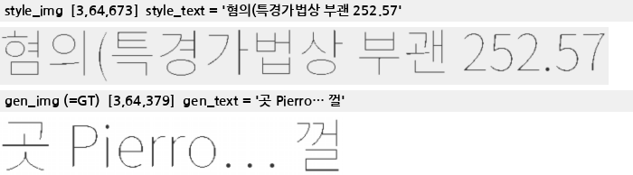
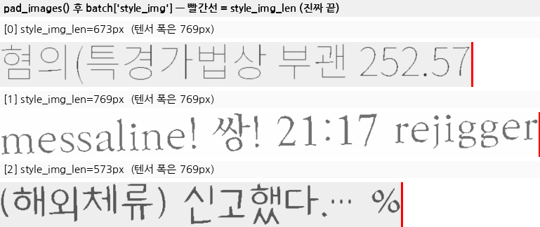
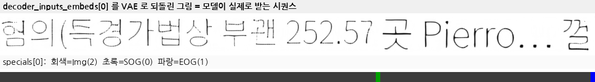
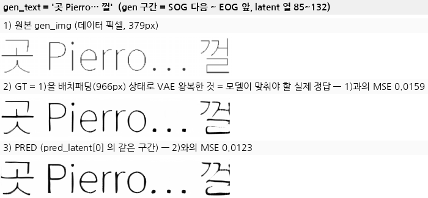
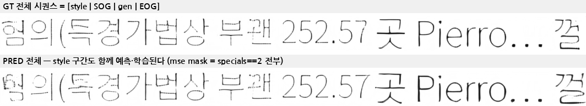
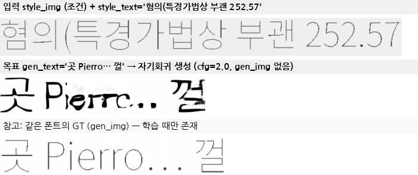

# Eruku 학습 모듈 I/O — 뭐가 들어가고 뭐가 나오는가 (실제 이미지 포함)

이 문서는 Eruku를 **하나의 학습 모듈(black box)** 로 봤을 때 필요한 입력·나오는 출력을
실제 텐서와 실제 렌더링 이미지로 보여준다.

모든 그림·수치는 `docs/_gen_module_io.py` 가 **학습 루프(`train.core.train`)와 완전히 같은 호출**
(`split_collate` → `get_model_inputs` → `forward`)을 한 배치에 돌려 생성한 것이다.

```bash
CUDA_VISIBLE_DEVICES=2 PYTHONPATH=. .venv/bin/python docs/_gen_module_io.py \
    --ckpt finetune_runs/korean_en2ko_fixed/checkpoint_step_014000.pth
# → docs/img_module_io/*.png + numbers.json
```

아래 수치는 그 실행(ckpt step 14000, batch 3, `max_img_len=2048`)의 `numbers.json` 값이다.

---

## 0. 한 줄 요약

> **입력** = (스타일 이미지 + 스타일 전사 텍스트, 목표 텍스트) — 학습 시엔 목표 이미지(GT)도
> **출력** = 목표 이미지의 **VAE latent 열(column) 시퀀스** + 각 열의 special 토큰 라벨
> **loss** = latent MSE + special CE

Eruku는 픽셀을 직접 뱉지 않는다. 64px 높이 라인 이미지를 VAE로 8배 줄인 **`[1, 8, W/8]` latent** 로 만든 뒤,
가로 방향 한 열(=원본 8px)을 **토큰 하나**로 보고 T5 디코더가 **다음 열을 autoregressive 하게 예측**한다.
픽셀 이미지는 마지막에 VAE decoder가 만든다.

---

## 1. 학습 모듈이 요구하는 입력

`custom_datasets.korean_split.split_collate` (`custom_datasets/korean_split.py:207`) 가 만드는 배치 dict가
학습 루프가 요구하는 전부다. 외부 데이터로 갈아끼우려면 **이 6개 키만 맞추면 된다.**

| 키 | 타입 | 설명 |
|---|---|---|
| `style_img` | `list[Tensor[3,64,W]]` | 스타일 참조 라인 이미지. 높이 **64 고정**, 값 범위 **[-1,1]** (`Normalize(0.5,0.5)`) |
| `gen_img` | `list[Tensor[3,64,W]]` | 목표(GT) 라인 이미지. 같은 규격. **학습 전용** — 추론 땐 `None` |
| `style_text` | `list[str]` | `style_img` 에 적힌 글자(전사) |
| `gen_text` | `list[str]` | 생성하고 싶은 글자 |
| `style_img_len` | `list[int]` | `style_img` 의 **진짜 가로 픽셀 폭** |
| `gen_img_len` | `list[int]` | `gen_img` 의 **진짜 가로 픽셀 폭** |

여기에 하이퍼파라미터 `max_img_len`(시퀀스 픽셀 예산, 기본 8192 → latent 토큰 1024)이 함께 들어간다.

실제 샘플 하나 (`01_inputs.png`):



```
style_text = "혐의(특경가법상 부괜 252.57"   style_img [3, 64, 673]   style_img_len = 673
gen_text   = "곳 Pierro… 껄"                gen_img   [3, 64, 379]   gen_img_len   = 379
```

> 위/아래 두 줄은 **같은 폰트(=같은 writer)** 로 렌더된다. 폰트를 필자로 간주하는 합성이라
> "이 필체로 저 글자를 써라" 라는 (style, target) 쌍이 라벨링 없이 무한 생성된다 →
> [`DATA_GENERATION.md`](DATA_GENERATION.md)

---

## 2. `style_len` / `gen_len` 은 왜 따로 받나 — 이미지에서 얻으면 안 되나?

**샘플 하나만 놓고 보면 얻을 수 있다.** 실제로 `split_collate` 가 하는 일이 정확히 그거다:

```python
"style_img_len": [b["style_img"].shape[-1] for b in batch],   # custom_datasets/korean_split.py:214
```

문제는 **그 시점이 배치로 묶이기 직전**이라는 것이다. 모델에 도착할 땐 이미 늦는다.

### (1) 배치 패딩이 폭 정보를 지운다 — 그것도 "복구 불가능하게"

`get_model_inputs` 는 맨 처음 `pad_images(...)` 로 배치 안의 서로 다른 폭을 최대폭에 맞춘다
(`models/eruku.py:198`). 그런데 **패딩 값이 `1`**(= 정규화 후 흰색, `pad_images` 기본값,
`models/eruku.py:56`)이다. 글자 사이 여백도 흰색이다. 즉 **패딩과 실제 여백이 픽셀값으로 구분되지 않는다.**



세 샘플 모두 텐서 폭은 769px로 같지만 진짜 끝(빨간 선)은 673 / 769 / 573px다.
`shape[-1]` 을 쓰면 세 샘플 다 769가 되어, [0]과 [2]는 **없는 흰 여백을 style 이미지로 학습**하게 된다.

> 참고: 원본 upstream은 여기서 한술 더 떠 `pad_images_fixed` 로 **8192px 고정 패딩**을 했다.
> 그 경우 `shape[-1]` 은 모든 샘플에서 그냥 8192다 — 폭 정보가 아예 존재하지 않는다.

### (2) 추론 땐 `gen_img` 자체가 없다

생성 시 호출은 이렇다 (`infer/show.py:254`):

```python
mi = model.get_model_inputs([style_img], None, style_len=W, gen_len=None, max_img_len=2048)
```

`gen_img=None` — 만들려는 이미지가 아직 없으니 폭을 이미지에서 얻는다는 개념이 성립하지 않는다.
길이 인자가 **학습/추론 공용 인터페이스**라서 학습 쪽도 같은 형태를 유지한다.

### (3) 원본 데이터 경로에선 폭이 "메타데이터"였다

원본 사전학습은 `[style | 20px 흰 간격 | gen]` 을 **한 장으로 렌더·증강한 뒤** 폭 숫자로 다시
쪼갠다. 이때 경계는 이미지 안에 시각적으로 존재하지 않고 오직 `style_img_width` 숫자로만 남는다
(→ [`PIPELINE_STEP_BY_STEP.md`](PIPELINE_STEP_BY_STEP.md)). 이 인자는 그 설계의 잔재이기도 하다.

### (4) 길이는 폭이 아니라 "예산(budget)" 으로도 쓰인다

`get_model_inputs` 안에서 `sl`/`gl` 은 그대로 쓰이지 않고 clamp된다
(`models/eruku.py:224`, `:240`):

```python
sl = max(64, min(sl, style_img_embeds.shape[-1] * 8, max_img_len // 2))   # style 은 예산의 절반까지
remaining = max(64, max_img_len - sl - 16)                                # SOG/EOG 2토큰 = 16px 예약
gl = max(64, min(gl, gen_img_embeds.shape[-1] * 8, remaining))
```

style이 예산을 다 먹어 gen 꼬리가 잘리면 모델이 EOG 위치를 잘못 배운다(= 조기 종료/문장 미완성).
`train.core.truncation_reason()` (`train/core.py:120`) 이 **같은 계산을 미리 돌려** 잘릴 샘플을
학습에서 아예 drop 하고 `truncated_samples.csv` 에 기록한다.

> ⚠️ **단위 함정**: `sl`/`gl` 은 **픽셀**, `*_img_embeds.shape[-1]` 은 **latent 폭(=픽셀/8)** 이다.
> `*8` 환산을 빼먹으면 style이 1/8로 잘린다 — 실제로 있었던 버그다
> ([`STYLE_LEN_BUG.md`](STYLE_LEN_BUG.md)).

---

## 3. `style_text` / `gen_text` 는 어디로 들어가나

**들어간다.** 다만 `get_model_inputs` 가 아니라 `forward()` 로 직접 들어간다. 경로가 완전히 다르기 때문이다:

| | 경로 | 들어가는 곳 |
|---|---|---|
| 이미지 (`style_img`, `gen_img`) | `get_model_inputs()` → VAE encode → latent | T5 **decoder** (`decoder_inputs_embeds`) |
| 텍스트 (`style_text`, `gen_text`) | `forward()` → `_encode_text()` → ByT5 tokenizer | T5 **encoder** (`inputs_embeds`) — cross-attention 조건 |

`get_model_inputs` 가 `@torch.no_grad()` 인 이유도 같다 — VAE는 동결이라 텐서 전처리일 뿐이고,
텍스트는 학습되는 embedding을 타야 하므로 `forward` 안에 있어야 한다.

텍스트 인코딩 (`models/eruku.py:284`):

```python
pairs = [f"{style}<sog>{gen}" for style, gen in zip(style_text, gen_text)]
enc = self.tokenizer(pairs, padding=True, return_tensors="pt")   # ByT5 = UTF-8 바이트 토크나이저
```

style과 gen 텍스트를 `<sog>` 로 이어 **한 문자열**로 넣는다. 디코더 시퀀스도
`[style latent | SOG | gen latent | EOG]` 라 인코더/디코더의 구조가 대응된다.

---

## 4. `get_model_inputs` 가 만드는 것 (모델이 실제로 받는 시퀀스)

`models/eruku.py:191`. 반환 3개:

| 키 | shape | 내용 |
|---|---|---|
| `decoder_inputs_embeds` | `[B, L, 8]` | `[style latent \| SOG \| gen latent \| EOG]` 를 이어붙인 열 시퀀스 |
| `specials` | `[B, L]` long | 각 열의 종류: `0=SOG, 1=EOG, 2=Img` (패딩은 1) |
| `lengths` | `[B]` | 패딩 제외 실제 길이(latent 열). 배치 생성 시 `prefix_lens` 로 넘겨야 패딩을 style로 먹지 않음 |

실측(batch 3): `decoder_inputs_embeds [3, 218, 8]`, `lengths = [133, 218, 184]`.
샘플 0은 latent 133열 = **1064px**, SOG는 84번째 열, Img 토큰 131개.

이 시퀀스를 다시 VAE로 디코딩해서 그리면 — 모델이 실제로 "보는" 것이 이렇다 (`03_decoder_seq.png`):



아래 색띠가 `specials` 다. 회색=Img(2), **초록=SOG(0)** 가 style/gen 경계, **파랑=EOG(1)** 가 맨 끝.
그림 위에서 `... 252.57` 까지가 style, 초록선 뒤 `곳 Pierro… 껄` 이 gen이다.

---

## 5. 출력 (a) — 학습: `forward()`

`models/eruku.py:295`. 호출과 반환:

```python
losses, pred_latent = model.forward(
    decoder_inputs_embeds_vae=dec,   # [B, L, 8]
    specials=sp,                     # [B, L]
    style_text=[...], gen_text=[...],
)
```

| 반환 | shape | 설명 |
|---|---|---|
| `losses["mse_loss"]` | scalar | 예측 latent vs 정답 latent MSE. **`specials==2`(Img) 위치만** 마스킹 (→ 5.1) |
| `losses["ce_loss"]` | scalar | 각 열의 special 토큰(SOG/EOG/Img) 분류 CE |
| `losses["ocr_loss"]` | scalar | `alpha=1.0` 이면 **항상 0** (OrigamiNet은 영어 전용이라 한글 학습에선 미사용) |
| `losses["loss"]` | scalar | `(ce + mse) * alpha + ocr * (1-alpha)`, `alpha=1.0` → `ce + mse` |
| `pred_latent` | `[B, 1, 8, L]` | 예측된 latent (VAE decode 하면 이미지) |

실측: `loss 0.0373 = mse 0.0372 + ce 0.00015` (step 14000 체크포인트).

`pred_latent` 를 VAE로 디코딩한 것이 **teacher-forcing 한 스텝의 출력**이다. `gen_text` 에
해당하는 구간(SOG 다음 ~ EOG 앞, 샘플0은 latent 열 85~132)만 잘라 입력과 짝지어 보면
(`04_teacher_forced.png`):



> `pred_latent[..., i]` 는 입력 `x_i` 의 예측이라 **GT와 같은 인덱스로 잘라야 짝이 맞는다.**
> 디코더 입력에 `sos` 를 붙이고 `output.logits[:, :-1]` 을 쓰기 때문에 (`models/eruku.py:341`)
> 반환 텐서는 이미 정렬돼 있다 — 따로 shift 할 필요가 없다.

**1)과 2)의 선명도가 다른 게 정상이다.** 2)는 1)을 그대로 쓴 게 아니라 **VAE를 한 번 왕복한 것**
(`vae.encode(...).latent_dist.sample()` → `vae.decode`)이다. §1의 `gen_img` 는 데이터 픽셀이고,
**모델이 맞춰야 하는 정답은 2)** 다 — 즉 1)과 2) 사이의 손실은 모델이 아무리 잘해도 못 넘는
상한이다(→ [`VAE_ROBUSTNESS.md`](VAE_ROBUSTNESS.md), 한글 fidelity 하드상한).

실측(샘플0의 gen 376px, 픽셀 MSE):

| 비교 | MSE |
|---|---|
| 1) 원본 vs 2) GT (`.sample()`, **학습 경로**) | **0.01586** |
| 1) 원본 vs `.mode()` 로 왕복 (비교용) | 0.00171 |
| 2) GT vs 3) PRED | 0.01233 |

> ⚠️ 눈에 보이는 열화의 **대부분은 VAE의 결정적 재구성 한계가 아니라 KL posterior 샘플링
> 노이즈**다(9.3배 차이). `_img_encode` 는 `.latent_dist.sample()` 을 쓰는데
> (`models/eruku.py:188`, 원본 Emuru/LDM 관례) **repo의 VAE 측정 스크립트는 전부
> `.mode()`** 를 쓴다(`docs/_vae_capacity.py:41`, `experiments/common.py:62`, …).
> 즉 문서화된 "VAE 한글 재구성 한계" 수치는 **모델이 실제로 받는 것보다 깨끗한 경로**를 잰 값이다.
>
> 추론 때 `_img_encode` 를 `.mode()` 로 바꿔 style prefix 노이즈를 없애면 어떨까 — 3샘플로
> A/B 해본 결과 **결론이 안 났다**: 한 샘플은 `.mode()` 가 문장을 끝까지 쓴 반면(`. sample()` 은
> 조기 EOG), 다른 샘플은 정반대였다. 선명도가 체계적으로 좋아지지도 않았다. 판단하려면
> `eval/htr_cer.py` 로 제대로 재야 한다 — **아직 안 했다.**

정답 열을 매 스텝 다시 넣어주므로(teacher forcing) 이 그림과 학습 loss는 실제 생성 품질보다
항상 낙관적이다. 실제 성능은 §6 자기회귀 생성으로 봐야 한다.

### 5.1 loss 는 정확히 무엇 위에서 계산되나

**"pred_img 와 gen_img 두 장을 비교" 가 아니다.** 세 가지가 다르다:

**① 픽셀이 아니라 latent.** `gen_img` 는 `get_model_inputs` 에서 이미 VAE latent로 바뀌어
`decoder_inputs_embeds` 안에 들어가 있고, MSE는 그 **latent 값끼리** 계산된다. 학습 중엔
`vae.decode` 자체가 호출되지 않는다(`alpha<1.0` 인 OCR loss 경로에서만 디코딩 — 지금은 off).
위 그림의 이미지들은 **설명을 위해 사후 디코딩한 것**이지 loss 경로가 아니다.

**② 정답은 "다음 열", 그리고 style 구간도 포함된다.** 마스크가 `specials==2`(Img)인데
**style 열도 Img로 라벨돼 있다** — 실측: 샘플0의 style 구간 84열이 전부 `specials==2`.
즉 모델은 `[style | SOG | gen | EOG]` **시퀀스 전체**를 다음-열 예측으로 학습한다.
style 구간을 이어 그릴 줄 알아야 추론 때 style prefix에서 이어받아 생성할 수 있기 때문이다
(`04b_teacher_forced_full.png`):



**③ CE는 패딩까지 포함한다.** `pad_sequence(specials, padding_value=1)` 이라 **패딩 열의 라벨이 EOG(1)** 다
(실측 확인: `pad_label_is_eog: true`). 결과적으로 "gen 끝난 뒤엔 계속 EOG" 를 CE가 가르친다.
MSE 쪽은 `specials!=2` 라 패딩이 자동 제외된다.

> ⚠️ **MSE 분모 주의**: `MSELoss()` 기본 `reduction='mean'` 인데 pred/gt 양쪽에 마스크를 곱한 뒤
> 평균을 내므로, 마스크된 위치는 오차 0으로 **분모에는 그대로 들어간다**(원본 코드의
> `#/mse_mask.sum()` 주석이 이 지점). 실측 배치에서 Img 원소 비율 80.9% →
> 코드값 `0.03718` vs Img 위치만으로 나눈 값 `0.04597`. **패딩이 많은 배치일수록 mse 가 낮게
> 찍힌다**는 뜻이라, 배치 구성이 다른 run 끼리 mse 절대값을 비교할 땐 주의해야 한다.

---

## 6. 출력 (b) — 추론: `generate()` / `generate_batch()`

`models/eruku.py:419`. `gen_img` 없이 **style prefix만** 넣고 EOG가 나올 때까지 열을 하나씩 뽑는다.

```python
mi = model.get_model_inputs([style_img], None, style_len=W, gen_len=None, max_img_len=2048)
img, special = model.generate(mi["decoder_inputs_embeds"], [style_text], [gen_text],
                              cfg_scale=2.0, max_new_tokens=200)
gen = crop_gen(img[0], special, mi["decoder_inputs_embeds"].shape[1] * 8)   # SOG 뒤만 남김
```

| 반환 | 설명 |
|---|---|
| `imgs[i]` | `[C, 64, W]` 라인 이미지, 값 [-1,1]. **style prefix가 앞에 붙어 있음** → `crop_gen` 으로 SOG 뒤만 자름 |
| `specials[i]` | 1-D (`3=style img, 2=image, 0=SOG, 1=EOG`). 진짜 경계는 첫 SOG 위치 |

실측: style prefix 84 latent열 → 생성 결과 344px (`05_generated.png`):



style 이미지의 필체를 그대로 가져와 새 텍스트를 썼다(`곳 Pierro… 껄`). 맨 아래는 같은 폰트의 GT —
학습 때만 존재하는 것이고, 생성에는 쓰이지 않았다.

> `cfg_scale` 은 classifier-free guidance. 학습 때 `--text-dropout` 으로 조건을 확률적으로 비워
> uncond 임베딩을 학습해 뒀기 때문에 쓸 수 있다. 1.0=guidance 없음.

---

## 7. 최소 학습 루프 (모듈로 쓸 때 전체)

```python
from torch.utils.data import DataLoader
from custom_datasets.korean_split import make_dataset, split_collate
from models.eruku import Emuru

ds = make_dataset(style_range=(1, 8), gen_range=(1, 32), seed=42)   # 온라인 무한 합성
dl = DataLoader(ds, batch_size=2, collate_fn=split_collate, num_workers=16)

model = Emuru(t5_checkpoint="google-t5/t5-large",
              vae_checkpoint="blowing-up-groundhogs/emuru_vae").to("cuda")
model.alpha = 1.0                 # OCR loss off
model.dropout_probability = 0.05  # CFG 용 text dropout
model.drop_text = True

for sample in dl:
    sample, dropped = filter_no_truncation(sample, max_img_len)   # train/core.py:139, truncation 금지 정책
    mi = model.get_model_inputs(sample["style_img"], sample["gen_img"],
                                sample["style_img_len"], sample["gen_img_len"], max_img_len)
    losses, _ = model.forward(decoder_inputs_embeds_vae=mi["decoder_inputs_embeds"].cuda(),
                              specials=mi["specials"].cuda(),
                              style_text=sample["style_text"], gen_text=sample["gen_text"])
    (losses["loss"] / grad_accum).backward()
    ...
```

실제 루프(grad accum, resume, val, 샘플 덤프, config 기록 포함)는 `train/core.py:251~` 참고.

### 학습되는 파라미터 / 동결되는 것

| 모듈 | 상태 |
|---|---|
| T5-large (encoder + decoder) | **학습** |
| `query_emb` / `t5_to_vae` / `t5_to_special` (latent↔d_model 선형층) | **학습** |
| `sos` / `sog` / `eog` / `uncond_embedding` | **학습** |
| VAE (`emuru_vae`) | **동결** (`set_training(self.vae, False)`) — 별도 `train/vae_korean.py` 로만 건드림 |
| OrigamiNet OCR | 로드조차 안 함 (`alpha=1.0`) |

---

## 8. 관련 문서

- [`DATA_GENERATION.md`](DATA_GENERATION.md) — 입력 쌍이 어떻게 합성되는가
- [`PIPELINE_STEP_BY_STEP.md`](PIPELINE_STEP_BY_STEP.md) — 렌더→증강→split 단계별 이미지
- [`STYLE_LEN_BUG.md`](STYLE_LEN_BUG.md) — `style_len` 픽셀↔latent 단위 버그
- [`VAE_ROBUSTNESS.md`](VAE_ROBUSTNESS.md) — 출력 품질의 하드 상한(VAE 재구성 한계)
- 하이퍼파라미터 전체 목록: `train/core.py:make_parser()` (라인 42~115),
  레시피는 `train/phase1.py:17` / `train/phase2.py:20` / `train/korean_from_en.py:23`
