# 원본 split 파이프라인 단계별 시각화 — "왜 회전 후에도 폭으로 잘라도 되는가"

`docs/_gen_pipeline_demo.py` 로 원본 `OnlineSplitFontSquare`의 transform을 **한 개씩 실제 실행**하며 저장한 이미지다.
- style 텍스트 = `스타일ABC` (왼쪽), gen 텍스트 = `생성123` (오른쪽)
- 폰트 = NanumGothic 1개, 배경 = `assets/backgrounds`
- 재현: `PYTHONPATH=. .venv/bin/python docs/_gen_pipeline_demo.py`

핵심 질문: **style·gen을 한 장으로 붙여 회전·워핑까지 한 뒤, 다시 "폭(가로 픽셀)"으로 자르면 회전 때문에 글자가 잘리지 않나?**
→ 결론부터: **안 잘린다.** 붙일 때 사이에 넣는 **20px 흰 간격(gap)** 이 완충 역할을 하고, 자르는 위치는 그 **간격의 정중앙**을 노리기 때문이다. 아래에서 이미지로 증명한다.

---

## 1. 정상(normal) 경우 — 단계별

### ① RenderImage — style / gen 을 각각 렌더 후 `[style | 20px 흰 간격 | gen]` 로 이어붙임
`font_transforms_split.py:100-107`
```python
np_img = np.concatenate([np_style_img, np.ones((h, 20)), np_gen_img], axis=1)
sample['style_img_width'] = np_style_img.shape[1] + 10   # 간격의 절반(10px)을 style 쪽에 포함
sample['gen_img_width']   = np_gen_img.shape[1] + 10     # 나머지 절반을 gen 쪽에
sample['total_img_width'] = np_img.shape[1]
```
이 순간부터 `sample['img']`는 **단일 텐서 한 장**이고, 경계는 오직 폭 숫자(`style_img_width`)로만 기억된다.
로그: `style_img_width=368, gen_img_width=294, total=662` → 368은 `style_실제폭(358) + 10`, 즉 **20px 간격의 한가운데(=중앙)** 를 가리킨다.

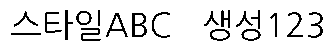

### ② RandomRotation — 스트립 **전체**에 회전각 1개 적용
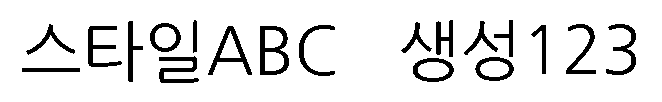

### ③ RandomWarping(TPS) — 스트립 **전체**에 워핑 격자 1개 적용


### ④ GaussianBlur
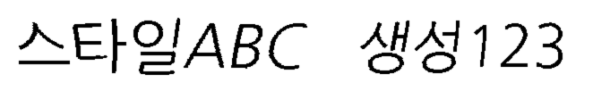

### ⑤~⑥ 배경 합성 + MergeWithBackground → 최종 컬러 이미지 (높이 64로 리사이즈됨)
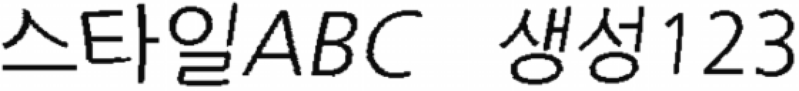

여기까지 회전·워핑·블러·배경이 **style/gen에 완전히 동일하게** 걸렸다(한 텐서였으니까).

---

## 2. 이제 다시 "폭으로 자르기" — 경계선을 그려보면

`font_square_split.py:215` 의 계산을 그대로 재현:
```python
W = sample['img'].shape[2]                                   # 최종 폭 560
cut = sample['style_img_width'] * W // sample['total_img_width']   # 368 * 560 // 662 = 311
style_img = sample['img'][:, :, :cut]   # 왼쪽
gen_img   = sample['img'][:, :, cut:]   # 오른쪽
```
계산된 경계 `cut=311` 을 **빨간 세로선**으로 그린 결과:

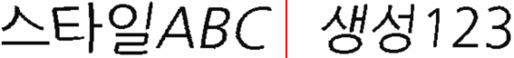

빨간 선이 **`ABC` 와 `생성` 사이의 흰 공간 한가운데**에 정확히 떨어진다. 어느 글자도 안 잘린다.
분리 결과(왼/오):

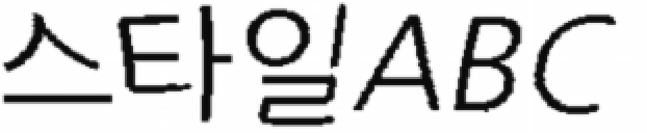
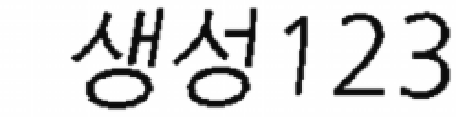

---

## 3. "회전이 크면 어긋날 텐데?" → 과장(exaggerated) 버전으로 검증

회전 8°, 워핑 강도 up 으로 강제한 경우. 워핑 후:

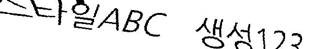

최종 + 경계선(`cut=217`):

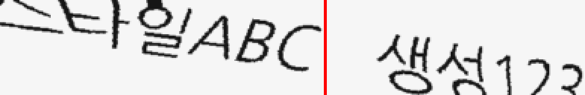

**이렇게 기울여도 빨간 선은 여전히 두 단어 사이 흰 공간 안**에 있다. 글자 관통 없음.

---

## 4. 왜 회전해도 안 잘리나 — 정리

1. **자르는 목표가 "간격의 정중앙"이다.** `style_img_width = 실제 style폭 + 10` 은 20px 흰 간격의 한복판을 가리킨다. 즉 경계는 글자 위가 아니라 **일부러 비워둔 흰 띠의 중앙**을 겨눈다.
2. **20px 흰 간격이 완충(tolerance)이다.** 회전·워핑이 경계를 좌우로 몇 px 흔들어도, 그 근방은 어차피 흰 배경이라 세로로 잘라도 흰 픽셀만 지나간다. 회전으로 간격이 비스듬해져도 폭이 충분해 수직 절단선이 흰 영역 안에 머문다.
3. **정밀 절단이 아니라 "대략 분리"면 충분하다.** 모델은 style 조각/ gen 조각을 대충 나눠 받으면 되고, 경계에 흰 여백 몇 px이 더/덜 붙는 건 무해하다.

### 다만 — 이 절단은 **근사(approximate)** 이지 픽셀 정확이 아니다
`TailorTensor`(⑥)가 잉크 bbox 기준으로 좌우 여백을 크롭하는데 **`total_img_width`를 갱신하지 않는다**(`font_transforms_split.py:283-299`). 그래서 비율 계산이 크롭 전 폭(662)을 쓴다:
- normal: 크롭 전 662 → 크롭 613 → 리사이즈 560. 그런데 `cut = 368 * 560 // 662`.
- 즉 좌측 여백이 잘려나간 만큼 실제 경계는 조금 왼쪽으로 이동했지만 공식은 그걸 무시한다.

이 오차(수 px)가 있어도 **20px 흰 간격이 흡수**하기 때문에 결과가 멀쩡한 것이다. 폰트/텍스트가 극단적이면 경계가 살짝 어긋날 수 있으나, 손글씨 생성 학습에는 문제되지 않는 수준의 slop이다.

---

## 5. 그런데 — **긴 텍스트에서는 실제로 깨진다** (직감이 맞다)

긴 문장으로 테스트했다.
- style = `오늘은 날씨가 맑고 바람이 시원하게 불어서 산책하기 좋은 날이었다`
- gen = `인공지능 모델이 손글씨 스타일을 학습하여 새로운 문장을 생성한다`
- 렌더 결과 폭 **3852px** (짧은 예제의 662px 대비 ~6배)

### 5-1. 회전이 없어도 — **워핑(TPS)만으로 마지막 글자가 잘린다**
회전을 완전히 꺼도(`rot_p=0`) 계산된 cut 이 style 마지막 글자 **「다」** 를 관통한다.

측정 (`docs/_analyze_cut.py`, 데모 long_normal 과 동일 체인):
```
계산된 cut = 1713,  cut 열의 잉크량 = 6   → 흰공간이 아니라 글자 위!
실제 흰 띠(gap) = 1758~1780 (중앙 1769)
→ cut 이 실제 gap 보다 56px 왼쪽  → 「다」의 한가운데를 지나감
```
경계부 5배 확대 (**빨강=계산된 cut, 초록=실제 흰 띠 중앙**):

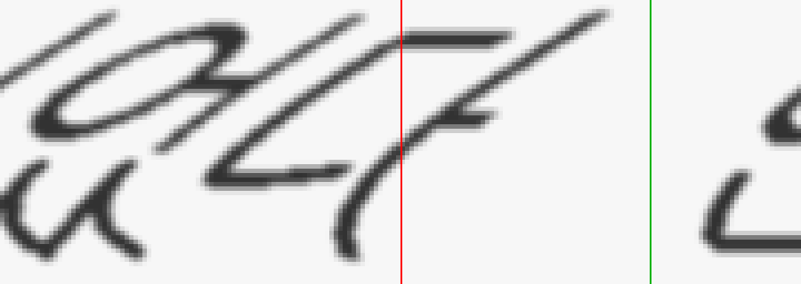

빨간 선이 「다」를 반으로 가르고, 진짜 흰 공간(초록)은 56px 오른쪽에 있다.
→ style_img 에는 「다」의 왼쪽 절반만 남고, gen_img 앞에는 「다」의 오른쪽 절반이 붙는다.

**원인 두 가지가 겹친다:**
1. **`TailorTensor`가 `total_img_width`를 갱신하지 않음** → 비율이 크롭 전 폭을 써서 체계적으로 어긋남(§4 후반).
2. **`RandomWarping`(TPS)은 비선형 변형** → 흰 띠가 휘어 옮겨지는데, 그 이동량 ≈ `std × (폭/2)` 로 **폭에 비례**한다. 폭 3852px에선 최대 ~96px까지 흔들려 20px 흰 띠를 훌쩍 넘는다. 짧은 662px에선 ~16px라 대체로 띠 안에 머문다.

> **정정:** 앞 버전에서 "길수록 안전"이라 썼으나 틀렸다. 워핑·회전을 **모두 끈 순수 crop**만이면 오차 −1px로 정확하지만, **워핑은 기본 `p=0.5`로 샘플 절반에 걸리고 그 이동량이 폭에 비례**하므로 실제로는 **길수록 경계 오차가 커진다.**

### 5-2. 진짜 문제는 **회전 + 고정 캔버스** — 양끝이 잘려나간다
`RandomRotation`은 `expand=False`(캔버스 크기 고정)로 동작한다. 넓고 낮은 스트립을 회전하면
**양 끝이 캔버스 위/아래 밖으로 밀려나 흰색으로 잘리고**, 뒤이어 `TailorTensor`가 그 흰 영역을 크롭해 버린다.

**실제 학습 최대치인 정확히 3° 회전**만 줘도 (폭 3852 → 크롭 후 2942, **~900px(23%) 소실**):

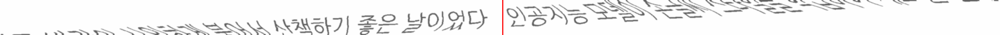

- 왼쪽 style 앞부분 `오늘은 날씨가 맑고 바람이…` 가 흐리게 날아가고,
- 오른쪽 gen 뒷부분 `…새로운 문장을 생성한다` 도 위로 잘려 사라졌다.
- 빨간 경계선은 여전히 흰 띠(중앙)에 있지만, **글자 내용 자체가 소실**됐다.

과장된 8° 에서는 폭이 3852 → **1158** 로 붕괴해 문장 대부분이 사라진다:

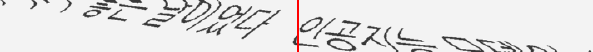

### 5-3. 임계 폭 — 왜 짧은 텍스트는 멀쩡했나
회전 시 끝점의 수직 이동량 ≈ `(폭/2) · sin θ`. 이게 캔버스 절반 높이(≈52px)를 넘으면 잘린다:

$$\text{안전 폭} \lesssim \frac{\text{높이}}{\sin\theta}$$

| 회전각 θ | 안전 폭 한계(높이 104 기준) | 짧은 예제(662px) | 긴 예제(3852px) |
|---------|---------------------------|-----------------|-----------------|
| 3° | ~2000px | ✅ 안전 | ❌ 900px 소실 |
| 8° | ~750px | ✅ 안전(그래서 §3 과장버전도 정상) | ❌ 절반 이상 소실 |

짧은 텍스트는 8°에도 임계 폭 아래라 멀쩡했던 것이고, 긴 텍스트는 3°에도 넘어선다.

### 5-4. 왜 이게 치명적인가 & 실전에서 왜 안 터지나
- **치명적 이유:** 픽셀은 잘렸는데 **라벨(`style_text`/`gen_text`)은 원문 전체 그대로** 남는다. `RenderImage`가 잘린 뒤 텍스트를 갱신하지 않기 때문. → **(이미지, 텍스트) 불일치** = 오염된 학습 샘플. 모델은 "안 보이는 글자를 쓰라"고 배우게 된다.
- **실전에서 안 터지는 이유:** 원본 레시피/논문이 텍스트를 **2~3어절(짧게)** 로 유지한다(메모리의 학습 레시피와 일치). 짧으면 임계 폭 아래라 클리핑이 없다. 즉 **이 분할 파이프라인은 "짧은 라인" 가정 위에 설계**됐고, 긴 라인은 설계 범위 밖이다.
- **긴 라인을 꼭 써야 한다면:** ① 회전을 렌더 *전*(단어 단위)으로 옮기거나 ② 회전에 `expand=True`를 쓰거나 ③ 회전각을 폭에 반비례로 줄이거나 ④ 잘린 뒤 실제 잉크 기준으로 텍스트/경계를 재라벨해야 한다.

---

## 6. 한 줄 요약

> **짧은 텍스트에선** style·gen 사이 20px 흰 띠 중앙을 비율로 겨눠 자르므로, 회전/워핑이 흔들어도 흰 공간만 지나가 안전하다.
> **긴 텍스트에선 두 가지가 동시에 깨진다:** ① **워핑(TPS)** 이동량이 폭에 비례해 20px 띠를 넘어서 **cut 이 마지막 글자(「다」)를 반으로 가르고**, ② **회전**이 고정 캔버스에서 **양끝을 잘라내** style 앞·gen 뒤를 소실시킨다. 둘 다 라벨은 원문 그대로라 **(이미지·텍스트) 불일치**를 만든다.
> 그래서 원본은 텍스트를 **2~3어절로 짧게** 유지하는 것이 사실상 필수 전제다.
