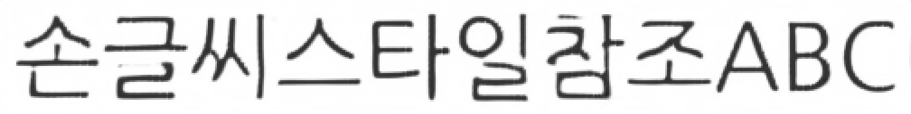
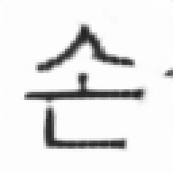

# style/gen 길이 clamp 단위 버그 — style 이 1/8 로 잘려 학습되던 문제

## 요약
`Emuru.get_model_inputs`(`eruku_continuous_inf.py`)에서 style/gen 길이를 제한하는 `min()` 의 항들이
**단위가 섞여**(픽셀 vs latent) 있어, 이 포크의 패딩 방식(배치최대)에서는 **style 이 실제 폭의 ~1/8(≈80px, 글자 1개 수준)로 잘려서** VAE 조건으로 들어갔다. 원본 repo 는 style 을 고정 8192px 로 패딩해 이 버그가 우연히 가려져 있었다.

- **증상:** style 조건이 거의 안 들어감 → 스타일 전이 품질 저하. 잘리는 양이 배치 최대폭에 의존해 학습/추론·배치마다 들쭉날쭉.
- **원인:** `sl`(픽셀) 을 `style_img_embeds.shape[-1]`(latent 폭 = 픽셀/8) 과 `min` → latent 폭이 8배 작아 그게 뽑히고, 다시 `[:sl//8]` 로 나눠 1/8 로 잘림.
- **수정:** latent 폭 항에 `* 8` 을 곱해 픽셀 단위로 환산.

---

## 버그 코드 (수정 전)
```python
# style (line ~192)
sl = max(64, min(sl, style_img_embeds.shape[-1], max_img_len // 2))
sample_embeds_parts = [style_img_embeds[el, :, :, :sl // 8]]
# gen (line ~208)
gl = max(64, min(gl, gen_img_embeds.shape[-1], remaining))
```
`min()` 세 항의 단위:
| 항 | 단위 | 예시(560px style) |
|----|------|------------------|
| `sl` | **픽셀** | 560 |
| `style_img_embeds.shape[-1]` | **latent (픽셀/8)** | 배치최대/8 ≈ 87 |
| `max_img_len // 2` | 픽셀 | 4096 |

VAE 가 폭을 8배 다운샘플(측정 확인: `[1,3,64,512] → latent [1,1,8,64]`)하므로 latent 폭이 픽셀보다 8배 작다.
→ `min` 이 거의 항상 latent 폭을 반환 → `sl` 이 latent 폭 값(87)으로 clamp → `[:87//8]=[:10]` → **80px 만 사용**.

`max_img_len // 2`(4096) 는 짧은 style(수백 px)에선 절대 안 걸리므로 **범인이 아니다.** 범인은 `style_img_embeds.shape[-1]` 항이다.

---

## 실측 증거 (`docs/_verify_style_len.py`)
동일 배치 `[420, 560, 700, 380]px`, `max_img_len=8192`:

**수정 전**
```
배치최대=700px  latent_width=87
  폭 420px → style 사용   80px (19%)
  폭 560px → style 사용   80px (14%)
  폭 700px → style 사용   80px (11%)
  폭 380px → style 사용   80px (21%)
```
→ 폭과 무관하게 전부 ~80px(글자 1개)만 사용.

**수정 후 (`* 8`)**
```
  폭 420px → style 사용  416px (99%)
  폭 560px → style 사용  560px (100%)
  폭 700px → style 사용  696px (99%)
  폭 380px → style 사용  376px (99%)
```
→ style 전체(≈100%)가 정상적으로 사용됨.

---

## 언제 발생하나 (정확한 트리거 조건)
잘림은 **`style_img_embeds.shape[-1] < sl_픽셀`** 일 때 발생한다. `style_img_embeds.shape[-1] = 패딩폭/8` 이므로:

> **패딩폭 < 8 × (자기 style 폭)** 이면 잘린다. 이때 style 은 `패딩폭/8` px 만 사용된다.

| 경로 | 패딩폭 | 결과 |
|------|--------|------|
| **추론(batch=1)** | 자기 폭 W | 정확히 **W/8 (=1/8)** 로 잘림 (최악) |
| **학습(batch, 비슷한 길이)** | 배치최대 ≈ W | 모든 샘플이 **배치최대/8** px 로 잘림 (≈1/8), 잘리는 양이 배치마다 변동 |
| **원본(고정 8192px 패딩)** | 8192 | style<1024px 면 `8192/8=1024 ≥ W` → **안 걸림(안전)** |

→ 즉 **이 포크의 모든 실사용 경로에서 상시 발생**했다. 안전한 유일 케이스는 style 을 자기 폭의 8배 이상으로 패딩할 때뿐(=원본 방식).

## 실제 케이스 이미지 — "모델이 받는 style" 을 VAE 로 복원 (`docs/_style_len_images.py`)
학습 체크포인트 없이도, `get_model_inputs` 의 slice 를 재현해 **모델에 실제 들어가는 style latent 를 VAE 디코더로 복원**하면 잘림이 그대로 보인다. style 텍스트 `손글씨스타일참조ABC` (506px), 추론 batch=1 기준:

**① 원본 style (전체 506px)**



**② 수정 전 — 모델이 실제로 받던 style (64px, 13%)**



→ `손` **한 글자**만 들어간다. 나머지 `글씨스타일참조ABC` 는 모델이 아예 못 본다. 스타일 참조가 사실상 무의미.

**③ 수정 후 — 모델이 받는 style (504px, 100%)**


→ 전체 style 이 정상 복원. (gen 도 동일 원리로 동일하게 복원됨)

```
BEFORE: sl=64px  → latent 8/63 열 사용  = 64px  (13%)
AFTER : sl=504px → latent 63/63 열 사용 = 504px (100%)
```

---

## 원본 repo 는 왜 멀쩡했나
원본 `train_eruku_continous.py` 는 collate 에서 style 을 **고정 8192px** 로 패딩한다:
```python
def pad_images_fixed(images, max_width=Config.MAX_IMG_LEN=8192, padding_value=1):
    ...  # 부족하면 8192 까지 pad, 넘치면 crop
```
→ `style_img_embeds.shape[-1] = 8192/8 = 1024`. 정상 폭(수백 px)의 `sl` 은 1024 보다 작으므로
`min(sl, 1024)=sl` → **clamp 안 걸림 → full style 사용**.

즉 원본은 **잘못된 단위 항을 고정 8192 패딩으로 "덮어" 두었을 뿐**이고, 이 포크가 패딩을 배치최대(가변 list → 내부 `pad_images`)로 바꾸면서 그 가림막이 사라져 버그가 드러났다. (`get_model_inputs` 는 학습 `train_core.py` 와 추론 양쪽에서 쓰이므로 둘 다 영향.)

| | style 패딩 | latent 폭 | `min` 결과 | style 사용 |
|---|---|---|---|---|
| 원본 | 고정 8192px | 1024 | 안 걸림 | ~100% |
| 포크(수정 전) | 배치최대 ~700px | ~87 | latent 폭으로 clamp | ~10~20% |
| 포크(수정 후) | 배치최대 | ~87 | `*8` → 안 걸림 | ~100% |

---

## 적용한 수정 (A안: 단위 맞추기)
`eruku_continuous_inf.py`:
```python
# style
sl = max(64, min(sl, style_img_embeds.shape[-1] * 8, max_img_len // 2))
# gen
gl = max(64, min(gl, gen_img_embeds.shape[-1] * 8, remaining))
```
`* 8` 로 latent 폭을 픽셀로 환산 → 배치최대 패딩에서도 full style/gen 사용.
남겨둔 `max_img_len//2`, `remaining` 은 픽셀 단위 예산 가드로 정상 작동(긴 style 이 gen 예산을 잠식하는 것 방지).

**대안 B:** `get_model_inputs` 호출 전 style/gen 을 고정 큰 폭으로 패딩(원본 `pad_images_fixed` 방식). 동작은 같으나 메모리·연산이 커서 A안 채택.

## 재현/검증
```bash
PYTHONPATH=. .venv/bin/python docs/_verify_style_len.py
# style/gen 사용률이 ~100% 로 나오면 정상.
```

## 수정 후에도 긴 텍스트에서 남는 문제 (예산 8192px 초과 시)
수정 전엔 style/gen 이 1/8 로 쪼그라들어 시퀀스가 항상 짧아 **예산(max_img_len) 로직이 잠자고 있었다.**
`*8` 로 gen 이 실폭을 쓰게 되자, **`style_px + gen_px + 16 > 8192`** 인 아주 긴 라인에서 예산 truncation 이 실제로 발동한다.

측정(`get_model_inputs`, 추론 batch=1, style 500px):
| gen 렌더폭 | seq_len(토큰) | gen 실제 사용 | EOG | 꼬리 잘림 |
|---|---|---|---|---|
| 2000px | 314 | 100% | 있음 | 아니오 |
| 5000px | 689 | 100% | 있음 | 아니오 |
| 8000px | 1024(한계) | 96% (7680px) | 있음 | **예** |
| 12000px | 1024 | **64%** (7680px) | 있음 | **예** |
| style5000+gen5000 | 1024 | style 82%, gen 82% | 있음 | **예(양쪽)** |

- **좋은 소식:** EOG 는 **항상 살아남는다**(SOG+EOG 16px 예약 + `max_seq_len=1024` 계산이 정확). → 무한생성/EOG 소실 버그는 **없음**.
- **남는 문제:** 예산을 넘는 긴 라인에선 gen(또는 style) **이미지 꼬리가 잘리는데 텍스트 라벨**(`forward` 의 `f"{style}<sog>{gen}"`)**은 원문 전체** → (이미지↔라벨) 불일치. 모델이 "긴 문장의 뒤를 버리고 일찍 EOG" 를 학습 = 원본 주석이 경고한 **조기 EOG** 그 자체.
- **발생 조건:** 렌더 폭 합 > ~7680px (height 64에서 100자+ 수준의 매우 긴 라인). **2~3어절 짧은 텍스트에선 절대 발생 안 함.**
- 또한 `max_img_len//2` 로 **style 은 4096px 초과분(꼬리)이 잘린다**(위 style5000 케이스 82%). 마찬가지로 긴 style 에서만.

→ 데이터생성 쪽 긴텍스트 문제(회전 클리핑·warp 경계 잘림, `PIPELINE_STEP_BY_STEP.md` §5)와 합쳐 **긴 라인이 깨지는 지점이 총 3곳**:
1. (데이터) 회전 `expand=False` 로 양끝이 캔버스 밖으로 잘림
2. (데이터) warp 로 style/gen 분할 cut 이 글자 관통
3. (모델입력) style+gen 렌더폭 합 > 8192px 이면 꼬리 truncation → 라벨 불일치

셋 다 **"짧은 라인(2~3어절)" 가정 위**에서만 안전. 긴 라인을 쓰려면 `max_img_len` 상향 + 데이터생성 회전/분할 방식 수정 + 라인 분할이 함께 필요.

## 영향 & 후속
- 이 버그 상태로 학습된 체크포인트는 style 을 거의 못 봤으므로, 수정 후 **재학습(또는 이어학습)** 권장.
- 원본 Emuru 체크포인트에서 파인튜닝 시 특히 치명적: 사전학습은 full style, 파인튜닝은 1/8 style → 조건 분포 불일치.
- `*8` 수정은 **짧은 텍스트(정상 경로)에는 순개선**(측정: 사용률 100%, EOG 정상, 시퀀스 짧음). 긴 텍스트에서만 위 예산 truncation 이 새로 드러나며, 이는 애초 파이프라인의 "짧은 라인" 전제를 벗어난 사용 때문이다.
